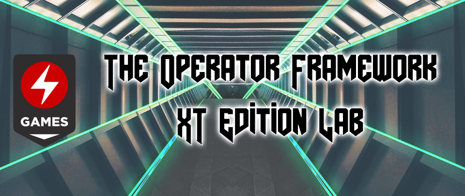
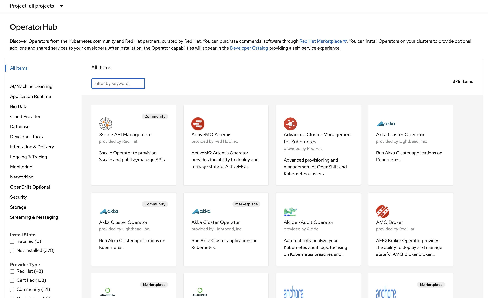

# The Operator Framework XT Edition Lab

I know it sounds a like a terrible title for an article about Operators, too close to a typical gaming YouTube channel video, but I'm very excited... Why?

Well, I started developing "demo/dummy" operators for research first, then to answer customers' doubts and guide them through the process of developing operators and finally because I like the subject. In any case, I started somewhere around February 2019 and since then til some days ago all versions of the Operator SDK were 0.x ... not anymore the **Operator SDK 1.0.0 is here and it comes with a lot of changes!**.

For a thorough explanation of those changes I suggest you to go [`here`](https://www.openshift.com/blog/operator-sdk-reaches-v1.0).

Among of those changes I'd like to highlight:

* Makefile including a bunch of useful targets that will make your life easier specially at the beginning.
* Use of kubebuilder to define RBAC rules (role/rolebinding) which means RBAC is in your Controller code and defined in the same way as validations and Form UI tweaks in Types, etc.
* Operator metadata format now defaults to `Bundle` instead of `PackageManifests`
* Use of [`kustomize`](https://github.com/kubernetes-sigs/kustomize) to generate manifests, deployment descriptors, etc.

So to celebrate `v1.0.0` I decided to dust off my `Gramola Operator` code that I had developed 6 months ago. Ok, ok, not that much dust had settled... ok, again, I wasn't exactly celebrating I had to migrate my code... But It was very rewarding, I have improved the code, and also it was the best way to see the value of the changes introduced.

*Gramola and Gramola Operator* you say? Bear with me, it's just a demo app and the operator to deploy it. An excuse to explain how to develop an operator and upgrade it using the Operator Lifecycle Manager or OLM.

Gramola is a simple application that shows a list of (musical) Events (hence the name of the app). It comprises:

- **frontend**: NodeJS/Angular application
- **gateway**: Quarkus simple API gateway
- **events**: Quarkus simple API
- **events-database**: PostgreSQL 10 Database

The operator deploys all the components, creates tables, Ingress rules or OpenShift Routes, etc. it also upgrades the database schema and migrates data if needed... BUT it's just a sample operator to, somewhat, open your eyes to the possibilities the Operator Framework offers...

Here you have a screenshot showing the end result and ultimate goal of the operator.

Nice Carlos... you're excited... (I can imagine some of your faces).

Ok, ok, TL;DR I guess.

## TL;DR

I'm presenting an end-to-end Operator Framework laboratory and demo guide for Operator SDK 1.0.0 all in the same [`repository`](https://github.com/atarazana/gramola-operator)

The purpose of this repository is twofold:

* **Providing a lab guide** to create and upgrade an operator from scratch and using the Operator Lifecycle Manager
* **Holding the code and demo script** of Gramola

So you can develop your own operator to then deploy it and upgrade it using **OLM** (for the brave!) or just deploy and upgrade the Gramola Operator (for... also the brave!).

This guide is divided into two parts.

In **Part One** you'll learn:

1. How to create an operator and how to deploy version 0.0.1
2. You will also learn how to evolve an operator as we'll move from version 0.0.1 to 0.0.2.
3. And even more importantly how to use the [Operator Lifecycle Manager](https://github.com/operator-framework/operator-lifecycle-manager) (**OLM**) to do all this automatically.

> **NOTE:** In order to make the **Part One** easier (Gramola is not complicated but it has too many moving parts) we're going to use the [Golang Based Operator Tutorial](https://sdk.operatorframework.io/docs/building-operators/golang/tutorial/) as a base for this lab.

The **2nd part** of the guide explains how to run a complete demonstration using the Gramola operator on Kubernetes, no need to code just enjoy deploying and upgrading Gramola.

**How is this guide different to others?**

1. It shows you how to get it all done from zero to upgrade your operator seamlessly using the Operator Lifecycle Manager.
2. It also shows you how to do this with Minikube and OpenShift.

## Why developing operators in the first place

If you've arrived here maybe you don't need any additional motivations... if that's not the case, then don't skip this point.

Operators in general are there to help you *to deploy and maintain* complex, stateful systems. Some examples:

* DataBases
* Monitoring Systems
* Streaming and Messaging
* Networking, Storage, ...

Ok, apparently basic systems your applications rely on, not your Apps themselves, because to deploy and maintain your apps you use CI/CD pipelines. 

Well... I think that under some circumstances Operators are (another) a very valid options to deploy applications. Let's have a look to some of those circumstances:

* You deploy complex systems for different branches in your company in Kubernetes clusters in different geolocations... Do your pipelines reach those locations? Or do you use scripts or other means to replicate the state of production in your main (1st) cluster.
* You're a software vendor and your portfolio (event ticketing system, SAP based XYZ system) can be SaaS or on-premise on top of Kubernetes. You develop a product and use CI/CD pipelines internally but you have to deliver and maintain a `product`.
* You don't develop all the custom software you consume. Do this 3rd companies developing for you end their pipelines in your cluster? Or do they use some automation mechanism or even scripts to deploy in production while their CI/CD pipelines are internal.

My humble opinion is that it makes sense to develop an Operator given these or similar circumstances. Operators contain the logic otherwise scattered between different layers... and they're Kubernetes native objects.

## The guide, the code, well all of it

You can find it all [here](https://github.com/atarazana/gramola-operator). By the way... maybe you're wondering (or will wonder later) why in a GitHub organization and not under my user... This is to make all the guide resemble what you would have in your own company, organization. It's not mandatory to do it like me just make it all look closer to reality.

## Being grateful first

Thanks to [Tero Ahonen](https://github.com/tahonen) who pushed me (inadvertently?) to create this.

Parts of the code of this operator were borrowed from another [operator](https://github.com/mcouliba/openshift-workshop-operator) coded by my colleague [Madou Couliba](https://github.com/mcouliba).

[Luis Arizmendi](https://github.com/luisarizmendi) was key to start working with OLM, [here](https://medium.com/@luis.ariz/operator-lifecycle-manager-review-f0885f9f3f1f) the article that helped me with this subject.

