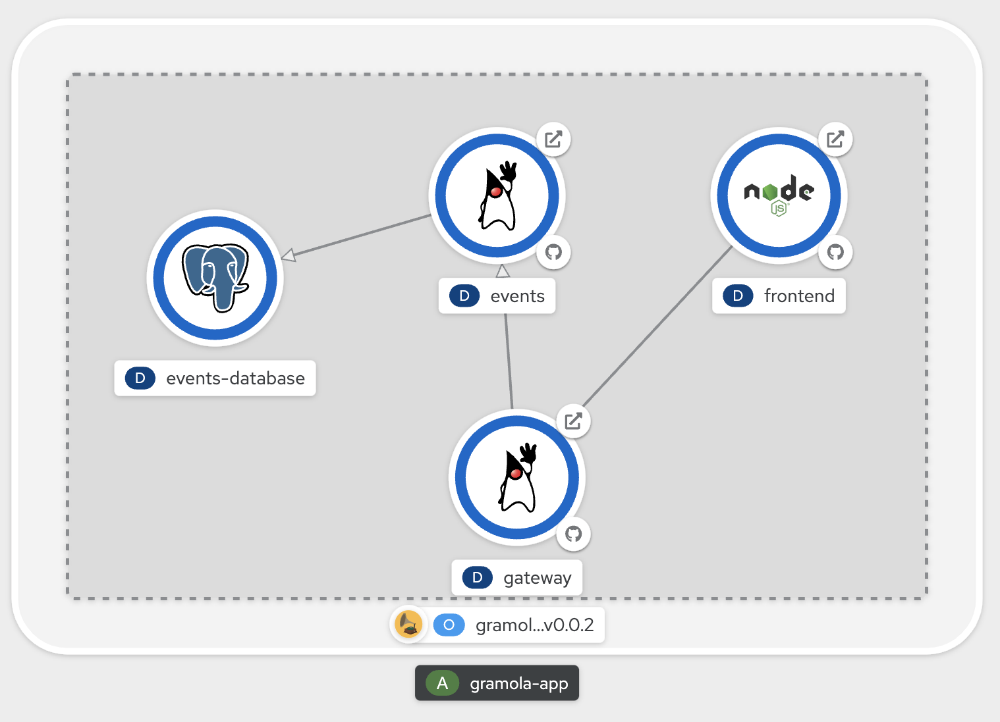

# An unsual Operator Framework Demo

# Introduction

After a conversation with my colleague [Tero](https://github.com/tahonen) we decided to prepare a session to highlight the benefits a developer can get from Operators in general and from the [Operator Framework](https://github.com/operator-framework) in particular. For that session we depicted two demos: one to show how easy it is to have a Kafka cluster on OpenShift (Red Hat's kubernetes distribution) and another one showing a custom operator that could deploy and update an application called [**Gramola**](https://github.com/cvicens/gramola). This is the repository for the latter.

Gramola is a simple application that shows a list of (musical) Events. It comprises:

- **frontend**: NodeJS/Angular application
- **gateway**: Quarkus simple API gateway
- **events**: Quarkus simple API
- **events-database**: PostgreSQL 10 Database

Here you have a screenshot showing the end result and ultimate goal of the operator.

The purpose of this repository is twofold:

* Lab guide to create and upgrade an operator from scratch and using the Operator Lifecycle Manager
* Hold the code and demo script of Gramola

So you can develop your own operator or just see one working and upgrading.

## TL;DR

This lab guide is divided into two parts.

In [Part One](./part-1-1.md) you'll learn:

1. How to create an operator and how to deploy version 0.0.1
2. You will also learn how to evolve an operator as we'll move from version 0.0.1 to 0.0.2.
3. And even more importantly how to use the [Operator Lifecycle Manager](https://github.com/operator-framework/operator-lifecycle-manager) to do all this automatically.

> **NOTE:** In order to make the whole example easier (Gramola is not complicated but it has too many moving parts) we're going to use the [Golang Based Operator Tutorial](https://sdk.operatorframework.io/docs/building-operators/golang/tutorial/) as base for this lab.

The [2nd part](./part-1-2.md) of the guide explains how to run a complete demonstration using the Gramola operator, no need to code just enjoy deploying and upgrading Gramola.

How is this guide different to others?

1. I show you how to get it all done from zero to upgrade your operator seamlessly using the Operator Lifecycle Manager.
2. I show you how to do this with Minikube and OpenShift

## Being grateful first

Parts of the code of this operator were borrowed from another [operator](https://github.com/mcouliba/openshift-workshop-operator) coded by my colleague [Madou](https://github.com/mcouliba).

