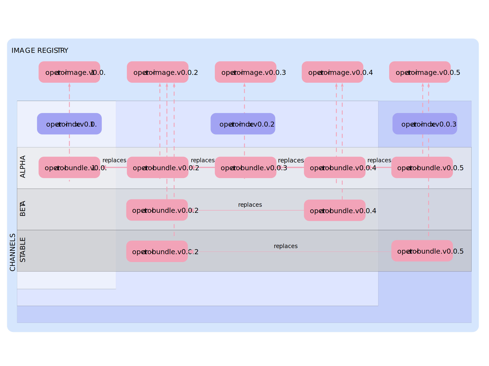

# Part One: Create and Upgrade and Operator using [OLM](https://github.com/operator-framework/operator-lifecycle-manager)

Part One is devoted to create an operator from scratch deploy it and upgrade it using the [Operator Lifecycle Manager](https://github.com/operator-framework/operator-lifecycle-manager).

We've divided this part into two steps:

1. Creating version 0.0.1 of a simple operator based on Memcached
2. Evolving the operator moving from version 0.0.1 to 0.0.2

## Prerequisites

It would be nice to have basic understanding of what an operator is to follow this guide, but it's not a requirement. Additionally, if you want to run the demo or create your own Operator you also need:

* [Go](https://golang.org/dl) 1.13.5+
* [Operator SDK](https://sdk.operatorframework.io/build/) v1.0.0+
* [Kubectl](https://kubernetes.io/docs/tasks/tools/#kubectl) 1.14.8+
* Access to an OCI compliant image registry where you can push images, I'll be using [quay.io](https://quay.io), other registries should work as well.
* Kubernetes/OpenShift Cluster (where you have administrative permissions) or use [Minikube](https://minikube.sigs.k8s.io/docs/start/) as we're going to do most of the time in this guide.

Quick access to install the Operator SDK [here](https://sdk.operatorframework.io/docs/installation/install-operator-sdk/)

For the lazy ones as myself...

```sh
mkdir -p ~/operators/bin
```

Either:

```sh
brew install operator-sdk
```

Or:

```sh
# Set the release version variable
$ RELEASE_VERSION=v1.0.0

# Linux
$ curl -LO https://github.com/operator-framework/operator-sdk/releases/download/${RELEASE_VERSION}/operator-sdk-${RELEASE_VERSION}-x86_64-linux-gnu && mv operator-sdk-${RELEASE_VERSION}-x86_64-linux-gnu ~/operators/bin/operator-sdk && chmod u+x ~/operators/bin/operator-sdk

# macOS
$ curl -LO https://github.com/operator-framework/operator-sdk/releases/download/${RELEASE_VERSION}/operator-sdk-${RELEASE_VERSION}-x86_64-apple-darwin && mv operator-sdk-${RELEASE_VERSION}-x86_64-apple-darwin ~/operators/bin/operator-sdk && chmod u+x ~/operators/bin/operator-sdk
```

Install kubectl if not done already.

```sh
# Linux
curl -LO "https://storage.googleapis.com/kubernetes-release/release/$(curl -s https://storage.googleapis.com/kubernetes-release/release/stable.txt)/bin/linux/amd64/kubectl"

# macOS
curl -LO "https://storage.googleapis.com/kubernetes-release/release/$(curl -s https://storage.googleapis.com/kubernetes-release/release/stable.txt)/bin/darwin/amd64/kubectl"

mv kubectl ~/operators/bin/kubectl && chmod u+x ~/operators/bin/kubectl

```

Export PATH:

```sh 
export PATH=~/operators/bin:$PATH
```

# Step 1: Creating the Gramola Operator

The next steps are basically the ones in [this](https://sdk.operatorframework.io/docs/building-operators/golang/quickstart/) guide. I just compiled the steps in that guide and simplified some things. I hope ;-)

## Log in to quay.io (or the registry you use)

You need the free account to use Quay as the repository for your operator manifests bundle. Then use those credentials to log in using docker/podman.

```sh
docker login quay.io
```

## Set up environment

Let's define some environment variables that will come handy later. Special attention to **GO111MODULE**.

For the sake of simplicity I've created script to load environment variables. 

> **NOTE:** You can change the `APP_NAME`, `ORGANIZATION` and definitely you want to change `USERNAME`. For instance below I have changed `APP_NAME` from gramola to gramophone so that I can have both operators.

```sh
cd ~/operators

cat << 'EOF' > ./settings.sh
export GO111MODULE=on

export APP_NAME=gramophone
export OPERATOR_NAME=${APP_NAME}-operator
export OPERATOR_IMAGE=${OPERATOR_NAME}-image

export ORGANIZATION=atarazana
export DOMAIN=${ORGANIZATION}.com
export API_VERSION=${APP_NAME}.${DOMAIN}/v1

export PROJECT_NAME=${OPERATOR_NAME}-system

export USERNAME=cvicens

export VERSION=0.0.1
EOF

chmod u+x ./settings.sh
```

Load environment:

```sh
. ./settings.sh
```

## Create the operator scaffold

We need to create the folder for the template code and change to it.

```sh
mkdir ${OPERATOR_NAME} && cd ${OPERATOR_NAME} 
```

Let's generate the scaffold!

```sh
operator-sdk init --domain=${DOMAIN} --repo=github.com/${ORGANIZATION}/${OPERATOR_NAME}
```

We're going to need the environment variables inside the operator folder.

```sh
mv ../settings.sh .
```

You should get something like this... as the suggestion says let's create an api.

```sh
...
go fmt ./...
go vet ./...
go build -o bin/manager main.go
Next: define a resource with:
$ operator-sdk create api
```

## Create an API

We're not covering the basics around operators here but let's do a super-quick recap.

An operator creates/manages things in a Kubernetes cluster as defined in what we call a Custom Resource. Well the definition of that type of object is called Custom Resource Definition (or CRD for short). We could also call it API... kind of right? Well in this context when we say API we're referring to the CRD.

For instance, this CR of type Kafka creates a Kafka cluster named 'my-cluster' where the storage is ephemeral and the number of replicas is 3.

```yaml
apiVersion: kafka.strimzi.io/v1beta1
kind: Kafka
metadata:
  name: my-cluster
  labels: {}
  namespace: gramola-olm-test
spec:
  kafka:
    config:
      offsets.topic.replication.factor: 3
      transaction.state.log.replication.factor: 3
      transaction.state.log.min.isr: 2
      log.message.format.version: '2.5'
    version: 2.5.0
    storage:
      type: ephemeral
    replicas: 3
    listeners:
      plain:
        authentiation:
          type: scram-sha-512
      tls:
        authentiation:
          type: tls
  entityOperator:
    topicOperator:
      reconciliationIntervalSeconds: 90
    userOperator:
      reconciliationIntervalSeconds: 120
  zookeeper:
    storage:
      type: ephemeral
    replicas: 3
```

In the case of Gramola the CRD is simple, it comprises the next attributes:

- **enabled**: boolean, mandatory (if `false` the operator should do nothing)
- **initialized**: boolean (filled by the operator, tells if the resource has been checked and initialized properly)
- **alias**: string (if set, it has to be one of: `Gramola`/`Gramophone`/`Phonograph`)
- **location**: string, defaults to `EMEA` (dummy)
- **platform**: string (it can only be `kubernetes` or `openshift`)
- **domainName**: string, defaults to `minikube.local` (only used if `platform == kubernetes`)

The next command creates a Golang struct representation of an empty template of CRD and also a Controller (the piece of code in charge of reacting to Kubernetes events of interest to the operator).

> **NOTE:** This has changed compare to versions 0.x now you can create the API and also the controller with one command thanks to `--resource=true` and `--controller=true`

```sh
operator-sdk create api --group ${APP_NAME} --version v1 --kind AppService --resource=true --controller=true
```

Before messing with the code, CRDs, etc. let me explain briefly what we have generated so far.

* [**./api**](./api): The main file here is `appservice_types.go` it contains the definition of our CRD
* **./config**: Basically contains templates/resources you'll use indirectly when running some targets in the Makefile (customization of descriptors will be done with [kustomize](https://kubernetes-sigs.github.io/kustomize/))
* **./controllers**: The key file here is `appservice_controller.go` is where the meat is, the operator controller code. The reconciliation loop is here, the Manager setup and Predicates code too.
* **./hack**: boilerplate.go.txt contains text you want to be inserted in generated file
* **./Dockerfile**: As you already know an operator needs to run as a container in a Kubernetes cluster... hence we need a Dockerfile. Pay attention to `# Copy the go source` if you need to put code in a different folder you have to add that folder there. 
* **./go.x**: Normal go modules helper files. If `GO111MODULE` is not set, go modules dependency management won't work. No worries it's already in the `settings.sh` file you created before.
* **./main.go**: Here is where the Manager is created and 
* **./Makefile**: 
* **./PROJECT**: 

## Time to init our repo and update .gitignore

Open `.gitignore` and add this at the end of the file...

```text
# Kubernetes dev env.
testbin

# Kubernetes run secret
run

# Debugging
__debug_bin

# Other
.DS_Store
downloaded/

# Virtual Python Env
venv/
```

Init the repo and add all files so far.

```sh
git init
git add .gitignore
git add *
git commit -a -m "init"
```

## Checking test target

Run `test` target and check everything is fine.

```sh
$ make test
go: creating new go.mod: module tmp
go: finding sigs.k8s.io/controller-tools/cmd v0.3.0
go: finding sigs.k8s.io/controller-tools/cmd/controller-gen v0.3.0
go: finding sigs.k8s.io v0.3.0
/Users/cvicensa/go/bin/controller-gen object:headerFile="hack/boilerplate.go.txt" paths="./..."
go fmt ./...
go vet ./...
/Users/cvicensa/go/bin/controller-gen "crd:trivialVersions=true" rbac:roleName=manager-role webhook paths="./..." output:crd:artifacts:config=config/crd/bases
mkdir -p /Users/.../gramophone-operator/testbin
test -f /Users/.../gramophone-operator/testbin/setup-envtest.sh || curl -sSLo /Users/.../gramophone-operator/testbin/setup-envtest.sh https://raw.githubusercontent.com/kubernetes-sigs/controller-runtime/v0.6.3/hack/setup-envtest.sh
source /Users/.../gramophone-operator/testbin/setup-envtest.sh; fetch_envtest_tools /Users/.../gramophone-operator/testbin; setup_envtest_env /Users/.../gramophone-operator/testbin; go test ./... -coverprofile cover.out
fetching envtest tools@1.16.4 (into '/Users/.../gramophone-operator/testbin')
x bin/
x bin/etcd
x bin/kubectl
x bin/kube-apiserver
setting up env vars
?   	github.com/atarazana/gramophone-operator	[no test files]
?   	github.com/atarazana/gramophone-operator/api/v1	[no test files]
ok  	github.com/atarazana/gramophone-operator/controllers	10.261s	coverage: 0.0% of statements
```

There should be these binaries in `./testbin/bin`

- `etcd`
- `kube-apiserver`
- `kubectl`

## Let's dope the makefile a bit more

Now we're going to replace the Makefile with the next one. I know... we have just changed the test target and now we replace the whole file? Well let's call this an artistic license... or that I'm running out of time writing this guide.

```makefile
include settings.sh

# Default bundle image tag
BUNDLE_IMG ?= quay.io/$(USERNAME)/$(OPERATOR_NAME)-bundle:v$(VERSION)
FROM_BUNDLE_IMG ?= quay.io/$(USERNAME)/$(OPERATOR_NAME)-bundle:v$(FROM_VERSION)
# Options for 'bundle-build'
ifneq ($(origin CHANNELS), undefined)
BUNDLE_CHANNELS := --channels=$(CHANNELS)
endif
ifneq ($(origin DEFAULT_CHANNEL), undefined)
BUNDLE_DEFAULT_CHANNEL := --default-channel=$(DEFAULT_CHANNEL)
endif
BUNDLE_METADATA_OPTS ?= $(BUNDLE_CHANNELS) $(BUNDLE_DEFAULT_CHANNEL)

# Bundle Index tag
BUNDLE_INDEX_IMG ?= quay.io/$(USERNAME)/$(OPERATOR_NAME)-index:v$(VERSION)
FROM_BUNDLE_INDEX_IMG ?= quay.io/$(USERNAME)/$(OPERATOR_NAME)-index:v$(FROM_VERSION)

# Catalog default namespace
CATALOG_NAMESPACE?=olm

# Image URL to use all building/pushing image targets
IMG ?= quay.io/$(USERNAME)/$(OPERATOR_IMAGE):v$(VERSION)
# Produce CRDs that work back to Kubernetes 1.11 (no version conversion)
CRD_OPTIONS ?= "crd:trivialVersions=true"

# Get the currently used golang install path (in GOPATH/bin, unless GOBIN is set)
ifeq (,$(shell go env GOBIN))
GOBIN=$(shell go env GOPATH)/bin
else
GOBIN=$(shell go env GOBIN)
endif

all: manager

# Run tests
ENVTEST_ASSETS_DIR = $(shell pwd)/testbin
test: generate fmt vet manifests
	mkdir -p $(ENVTEST_ASSETS_DIR)
	test -f $(ENVTEST_ASSETS_DIR)/setup-envtest.sh || curl -sSLo $(ENVTEST_ASSETS_DIR)/setup-envtest.sh https://raw.githubusercontent.com/kubernetes-sigs/controller-runtime/v0.6.3/hack/setup-envtest.sh
	source $(ENVTEST_ASSETS_DIR)/setup-envtest.sh; fetch_envtest_tools $(ENVTEST_ASSETS_DIR); setup_envtest_env $(ENVTEST_ASSETS_DIR); go test ./... -coverprofile cover.out

# Build manager binary
manager: generate fmt vet
	go build -o bin/manager main.go

# Run against the configured Kubernetes cluster in ~/.kube/config
run: generate fmt vet manifests
	export DB_SCRIPTS_BASE_DIR=. && go run ./main.go

# Install CRDs into a cluster
install: manifests kustomize
	$(KUSTOMIZE) build config/crd | kubectl apply -f -

# Uninstall CRDs from a cluster
uninstall: manifests kustomize
	$(KUSTOMIZE) build config/crd | kubectl delete -f -

# Deploy controller in the configured Kubernetes cluster in ~/.kube/config
deploy: manifests kustomize
	cd config/manager && $(KUSTOMIZE) edit set image controller=${IMG}
	$(KUSTOMIZE) build config/default | kubectl apply -f -

# Undeploy controller in the configured Kubernetes cluster in ~/.kube/config
undeploy: manifests kustomize
	cd config/manager && $(KUSTOMIZE) edit set image controller=${IMG}
	$(KUSTOMIZE) build config/default | kubectl delete -f -

# Generate manifests e.g. CRD, RBAC etc.
manifests: controller-gen
	$(CONTROLLER_GEN) $(CRD_OPTIONS) rbac:roleName=manager-role webhook paths="./..." output:crd:artifacts:config=config/crd/bases

# Run go fmt against code
fmt:
	go fmt ./...

# Run go vet against code
vet:
	go vet ./...

# Generate code
generate: controller-gen
	$(CONTROLLER_GEN) object:headerFile="hack/boilerplate.go.txt" paths="./..."

# Build the docker image
docker-build: test
	docker build . -t ${IMG}

# Push the docker image
docker-push:
	docker push ${IMG}

# Run the container using docker
# Create ./run/ca.crt ./run/server-ca.crt and ./run/token 
docker-run:
	docker run -it --rm --entrypoint /bin/bash -v $(shell pwd)/run:/var/run/secrets/kubernetes.io/serviceaccount \
	  -e KUBERNETES_SERVICE_PORT_HTTPS=6443 \
	  -e KUBERNETES_SERVICE_PORT=6443 \
	  -e KUBERNETES_SERVICE_HOST=api.cluster-644b.644b.example.opentlc.com ${IMG}

# find or download controller-gen
# download controller-gen if necessary
controller-gen:
ifeq (, $(shell which controller-gen))
	@{ \
	set -e ;\
	CONTROLLER_GEN_TMP_DIR=$$(mktemp -d) ;\
	cd $$CONTROLLER_GEN_TMP_DIR ;\
	go mod init tmp ;\
	go get sigs.k8s.io/controller-tools/cmd/controller-gen@v0.3.0 ;\
	rm -rf $$CONTROLLER_GEN_TMP_DIR ;\
	}
CONTROLLER_GEN=$(GOBIN)/controller-gen
else
CONTROLLER_GEN=$(shell which controller-gen)
endif

kustomize:
ifeq (, $(shell which kustomize))
	@{ \
	set -e ;\
	KUSTOMIZE_GEN_TMP_DIR=$$(mktemp -d) ;\
	cd $$KUSTOMIZE_GEN_TMP_DIR ;\
	go mod init tmp ;\
	go get sigs.k8s.io/kustomize/kustomize/v3@v3.5.4 ;\
	rm -rf $$KUSTOMIZE_GEN_TMP_DIR ;\
	}
KUSTOMIZE=$(GOBIN)/kustomize
else
KUSTOMIZE=$(shell which kustomize)
endif

# Generate bundle manifests and metadata, then validate generated files.
.PHONY: bundle
bundle: manifests kustomize
	operator-sdk generate kustomize manifests -q
	cd config/manager && $(KUSTOMIZE) edit set image controller=$(IMG)
	$(KUSTOMIZE) build config/manifests | operator-sdk generate bundle -q --overwrite --version $(VERSION) $(BUNDLE_METADATA_OPTS)
	operator-sdk bundle validate ./bundle

# Build the bundle image.
.PHONY: bundle-build
bundle-build:
	docker build -f bundle.Dockerfile -t $(BUNDLE_IMG) .

# Push the bundle image.
bundle-push: bundle-build
	docker push $(BUNDLE_IMG)

# Do all the bundle stuff
bundle-validate: bundle-push
	operator-sdk bundle validate $(BUNDLE_IMG)

# Do all bundle stuff
bundle-all: bundle-build bundle-push bundle-validate

# Bundle Index
# Build bundle by referring to the previous version if FROM_VERSION is defined
ifndef FROM_VERSION
  CREATE_BUNDLE_INDEX  := true
endif
index-build:
ifeq ($(CREATE_BUNDLE_INDEX),true)
	opm -u docker index add --bundles $(BUNDLE_IMG) --tag $(BUNDLE_INDEX_IMG)
else
	echo "FROM_VERSION ${FROM_VERSION}"
	opm -u docker index add --bundles $(BUNDLE_IMG) --from-index $(FROM_BUNDLE_INDEX_IMG) --tag $(BUNDLE_INDEX_IMG)
endif
	
# Push the index
index-push: index-build
	docker push $(BUNDLE_INDEX_IMG)

# [DEBUGGING] Export the index (pulls image) to download folder
index-export:
	opm index export --index="$(BUNDLE_INDEX_IMG)" --package="$(OPERATOR_NAME)"

# [DEBUGGING] Create a test sqlite db and serves it
index-registry-serve:
	opm registry add -b $(FROM_BUNDLE_IMG) -d "test-registry.db"
	opm registry add -b $(BUNDLE_IMG) -d "test-registry.db"
	opm registry serve -d "test-registry.db" -p 50051

# [DEMO] Deploy previous index then create a sample subscription then deploy current index
catalog-deploy-prev: # 1. Install Catalog version 0.0.1
	sed "s|BUNDLE_INDEX_IMG|$(FROM_BUNDLE_INDEX_IMG)|" ./config/catalog/catalog-source.yaml | kubectl apply -n $(CATALOG_NAMESPACE) -f -

install-operator:    # 2. Install Operator => Create AppService and create sample data
	kubectl operator install $(OPERATOR_NAME) --create-operator-group -v v$(FROM_VERSION)
	kubectl operator list

catalog-deploy:      # 3. Upgrade Catalog to version 0.0.2
	sed "s|BUNDLE_INDEX_IMG|$(BUNDLE_INDEX_IMG)|" ./config/catalog/catalog-source.yaml | kubectl apply -n $(CATALOG_NAMESPACE) -f -

upgrade-operator:    # 4. Upgrade Operator, since it's manual this step approves the install plan. Notice schema upgraded and data migrated!
	kubectl operator upgrade $(OPERATOR_NAME)

uninstall-operator:  # 5. Clean 1. Unistall Operator and delete AppService object
	kubectl operator uninstall $(OPERATOR_NAME) --delete-operator-groups

catalog-undeploy:    # 6. Clean 2. Delete Catalog
	sed "s|BUNDLE_INDEX_IMG|$(BUNDLE_INDEX_IMG)|" ./config/catalog/catalog-source.yaml | kubectl delete -n $(CATALOG_NAMESPACE) -f -
```

Now let's explain a little what we have changed.

**Variables:**

> Don't worry if you don't know what's a bundle, a bundle index or a catalog... just bear with me we'll cover that later. Just be conscious of the changes made.

- We have deleted the `VERSION ?= 0.0.1` and added `include settings.sh`
- Changed `BUNDLE_IMG` so that the bundle image is a full name related to the operator name and version
- Added `FROM_BUNDLE_IMG` to do the same but for the previous version, in this demo it will be 0.0.1
- Added `Bundle Index tag` section to define bundle index images similarly to the bundle images
- Updated `IMG`, again to make the operator image name dependent of the environment variables.
- Updated `run` target by adding an environment variable to allow the operator find the DB scripts
- Added target `undeploy` to delete all the objects created when `deploy` is run
- Added target `docker-run` just in case you want to run the operator as an image (opposite to the `run` target where you run the code locally). You need to add a folder `./run` to be mounted as `/var/run/secrets/kubernetes.io/serviceaccount`
- Added targets `bundle-push`, `bundle-validate` and `bundle-all` to push the bundle image to the registry, validate it or do all at once
- Added targets `index-build`, `index-push`, `index-export` and `index-registry-serve` to handle bundle indexes and the registry databases
- Added targets `catalog-deploy-prev`, `install-operator`, `catalog-deploy`, `upgrade-operator`, `uninstall-operator` and `catalog-undeploy` to handle the operator catalog and as a whole to run the demonstration for gramola.

> **NOTE:** Take into account that this setup was created for the Gramola Operator demonstration, I say this because you should take it as a source of inspiration and to help you get started not as a one-size-fit-all-kind-of template.

## Building v0.0.1

Well it's time to look into the code and make it actually do something. As we have explained at the core of any operator lays a controller watching at Kubernetes events, in particular events related to objects of interest, for instance our CRDs and other object the operator owns (Pods, Deployments, etc.).

### Defining the CRD (API)

Let's get started, let's update the empty CRD and add some attributes.

Open file `./api/v1/appservice_types.go` and look for this.

```go
// AppService is the Schema for the appservices API
type AppService struct {
	metav1.TypeMeta   `json:",inline"`
	metav1.ObjectMeta `json:"metadata,omitempty"`

	Spec   AppServiceSpec   `json:"spec,omitempty"`
	Status AppServiceStatus `json:"status,omitempty"`
}
```

As you can see this struct declares a normal Kubernetes object comprising:

* **TypeMeta:** Kind and APIVersion
* **ObjectMeta:** Name, Labels, Annotations, etc.
* **Spec:** This is where define the attributes of the *specification* of our CRD
* **Status:** Here we define the attributes to *status* of the system we're managing from the controller reconciliation loop 

So for instance in this simple example we want to deploy a Memcached cluster and one of the attributes of the specification of the cluster could include `number of replicas` as an attribute, right?

Let's add an attribute called Size, substitute this:

```go
    // Foo is an example field of AppService. Edit AppService_types.go to remove/update
	Foo string `json:"foo,omitempty"`
```

With this:

> **TIP:** You can associate a validation (that will be used by Kubernetes to check if the CR is valid) to the attributes you add to the CRD as in this example: `Minimum=0`. Go [here](https://book.kubebuilder.io/reference/markers/crd-validation.html) for a complete list of validations.

```go
    // +kubebuilder:validation:Minimum=0
	// Size is the size of the memcached deployment
	Size int32 `json:"size"`
```

Additionally, It would be nice to have a list of Memcached node names in the status. Find this:

```go
// AppServiceStatus defines the observed state of AppService
type AppServiceStatus struct {
	// INSERT ADDITIONAL STATUS FIELD - define observed state of cluster
	// Important: Run "make" to regenerate code after modifying this file
}
```

And replace it with this:

```go
// AppServiceStatus defines the observed state of AppService
type AppServiceStatus struct {	
	// Nodes are the names of the memcached pods
	Nodes []string `json:"nodes"`
}
```

> **IMPORTANT!!!** Every time you change the CRD you have to run `make` it will run `make generate` and the `zz_generated.deepcopy.go` file will be regenerated.

Let's do it now. Save the file and run:

```
make
```

Have a look to `./api/v1/zz_generated.deepcopy.go` or run this command to see that the file has changed as a result of running `make generate`.

> **NOTE:** `make generate` will invoke the [**controller-gen**](https://github.com/kubernetes-sigs/controller-tools) utility to update the api/v1alpha1/zz_generated.deepcopy.go. No need to install anything it's all handled by the Makefile.

```sh
grep "Node" ./api/v1/zz_generated.deepcopy.go
```

**Notice** the mark `+kubebuilder:subresource:status` that adds a status subresource to the CRD manifest so that the controller can update the CR status without changing the rest of the CR object. ***You don't have to change anything this was done by the `init` command when we generate the scaffold code.***

```go
// +kubebuilder:object:root=true
// +kubebuilder:subresource:status

// AppService is the Schema for the appservices API
type AppService struct {
	metav1.TypeMeta   `json:",inline"`
	metav1.ObjectMeta `json:"metadata,omitempty"`

	Spec   AppServiceSpec   `json:"spec,omitempty"`
	Status AppServiceStatus `json:"status,omitempty"`
}
```

There something else that needs to be generated, the CRD descriptors. So far we have defined the struct in go, but not the YAML representation of that object. This is done with the next makefile target. Please run it:

> **NOTE:** The generated CRD descriptor goes `./config/crd/bases`. Open the descriptor and you'll find `Size` and `Nodes`.

```sh
make manifests
```

### Adding some code to our empty Controller

Before adding the code let me explain what it does. Our Controller will run the next reconciliation logic for each AppService CR:

* Create a Memcached Deployment if it doesn’t exist
* Ensure that the Deployment size is the same as specified by the Memcached CR spec
* Update the Memcached CR status using the status writer with the names of the Memcached pods

Now maybe you're wondering... **What's the entry point of a Controller? How does it start dealing with events? What events? Does it glow in the dark?**

Let's change the code of our empty controller with this one. Open file `./controllers/appservice_controller.go`

> **NOTE:** If you want to have a look to the original controller of the tutorial go [here](https://raw.githubusercontent.com/operator-framework/operator-sdk/master/example/memcached-operator/memcached_controller.go.tmpl).

```sh
curl https://raw.githubusercontent.com/atarazana/gramola-operator/master/templates/memcached_controller.go.tmpl | \
  sed s/example\-inc/${ORGANIZATION}/g | \
  sed s/cache\.example\.com/${APP_NAME}.${DOMAIN}/g | \
  sed s/memcached\-operator/${OPERATOR_NAME}/g | \
  sed s/cachev1alpha1/${APP_NAME}v1/g | \
  sed s/v1alpha1/v1/g | \
  sed s/MemcachedReconciler/AppServiceReconciler/g | \
  sed s/Memcached/AppService/g | \
  sed s/memcacheds/appservices/g | \
  sed s/WithValues\(\"memcached\"/WithValues\(\"appservice\"/g | \
  sed 's/"memcached", "memcached_cr"/"appservice", "appservice_cr"/g' | \
  sed 's/\([^"]\)memcached\([^"]\)/\1appservice\2/g' > ./controllers/appservice_controller.go 
```

Let's compile to see if everything is ok.

```sh
make
```

Ok, let's have a look to the most interesting parts of the controller and try to answer those caustic questions.

Let me start from the beginning the entry point of our operator is `main.go`, kind of obvious... Let's have a look to this file.

First have a look to function `init()` here is where we add the APIs we want to use. In this case we're composing a `Scheme` with `clientgoscheme` and our own `gramophonev1`. 

> **NOTE:** For instance if we need OpenShift Routes, we'd add it like this: `utilruntime.Must(routev1.AddToScheme(scheme))`

```go
func init() {
	utilruntime.Must(clientgoscheme.AddToScheme(scheme))

	utilruntime.Must(gramophonev1.AddToScheme(scheme))
	// +kubebuilder:scaffold:scheme
}
```

Now let's have a look to the `main()` function. Here `NewManager()` builds a `Manager` with the scheme we composed on `init()`, and other parameters related to metrics and leader election (relevant when you have more than one replica of the operator).

```go
func main() {
	...

	mgr, err := ctrl.NewManager(ctrl.GetConfigOrDie(), ctrl.Options{
		Scheme:             scheme,
		MetricsBindAddress: metricsAddr,
		Port:               9443,
		LeaderElection:     enableLeaderElection,
		LeaderElectionID:   "8f00f1eb.atarazana.com",
	})
	if err != nil {
		setupLog.Error(err, "unable to start manager")
		os.Exit(1)
	}
```

Next stop, `SetupWithManager()` this function belongs to the controller where we have defined it under `AppServiceReconciler`. It creates a new controller that will be started by the provided `Manager`. This way the `Controller` is managed by the `Manager` but configured in a method of the `Controller`.

> *NOTE:* The `Controller` is initialized with `Client` and `Scheme` from the Manager.

```go
	if err = (&controllers.AppServiceReconciler{
		Client: mgr.GetClient(),
		Log:    ctrl.Log.WithName("controllers").WithName("AppService"),
		Scheme: mgr.GetScheme(),
	}).SetupWithManager(mgr); err != nil {
		setupLog.Error(err, "unable to create controller", "controller", "AppService")
		os.Exit(1)
	}
```

Last stop, starting the controller. From the documentation: *“**Start() starts all registered Controllers** and blocks until the Stop channel is closed. **Returns an error if there is an error starting any controller**. If LeaderElection is used, the binary must be exited immediately after this returns, otherwise components that need leader election might continue to run after the leader lock was lost”*

```go
	setupLog.Info("starting manager")
	if err := mgr.Start(ctrl.SetupSignalHandler()); err != nil {
		setupLog.Error(err, "problem running manager")
		os.Exit(1)
	}
}
```

So far we have answered this question.

* What's the entry point of a Controller? The controller starts when Start() is called in the Manager that manages our Controller.

Now let's have a look to the Controller the manager starts. First we find the struct `AppServiceReconciler` this is filled in `main()` and has a client (Kubernetes client to get/set/... objects), Log (logging utility), Scheme (explained before). 

```go
...
// AppServiceReconciler reconciles a AppService object
type AppServiceReconciler struct {
	client.Client
	Log    logr.Logger
	Scheme *runtime.Scheme
}
```

Event reconciliation ends up calling this method. This is where the logic of our Controller should be. If it all goes well it returns `ctrl.Result{}, nil` otherwise `ctrl.Result{}, err`.

> **NOTE:** If you have not finished, and need to run the `Reconcile()` function again after some time then you use this:
>
> ```go
> return reconcile.Result{
>				RequeueAfter: time.Second,
>				Requeue:      true,
>			}, nil
> ```

```go
...
func (r *AppServiceReconciler) Reconcile(req ctrl.Request) (ctrl.Result, error) {
	ctx := context.Background()
	log := r.Log.WithValues("appservice", req.NamespacedName)

	// Fetch the AppService instance
	appservice := &gramophonev1.AppService{}
	err := r.Get(ctx, req.NamespacedName, appservice)
	if err != nil {
		if errors.IsNotFound(err) {
			// Request object not found, could have been deleted after reconcile request.
			// Owned objects are automatically garbage collected. For additional cleanup logic use finalizers.
			// Return and don't requeue
			log.Info("AppService resource not found. Ignoring since object must be deleted")
			return ctrl.Result{}, nil
		}
		// Error reading the object - requeue the request.
		log.Error(err, "Failed to get AppService")
		return ctrl.Result{}, err
	}

	...

	// Update status.Nodes if needed
	if !reflect.DeepEqual(podNames, appservice.Status.Nodes) {
		appservice.Status.Nodes = podNames
		err := r.Status().Update(ctx, appservice)
		if err != nil {
			log.Error(err, "Failed to update AppService status")
			return ctrl.Result{}, err
		}
	}

	return ctrl.Result{}, nil
}
```

Well that's basically a Controller a `Reconcile()` function where you use the Kubernetes client API to create, delete, list, objects. Time for checking the pending questions.

* **How does it start dealing with events?** Whenever there's a new event related to the objects watched the `Reconcile()` method is called.

So there's one more question to answer: What events?

Please have a look to the next piece of code. Do you remember that in `main()` before starting the manager and it's controllers you have to set them up? Well when this is the method called from the main() function to create the controller, set it up and link it to the manager.

```go
func (r *AppServiceReconciler) SetupWithManager(mgr ctrl.Manager) error {
	return ctrl.NewControllerManagedBy(mgr). // creating the linked controller
		For(&gramophonev1.AppService{}). // Watching AppService events
		Owns(&appsv1.Deployment{}). // Also watching events from owned Deployments
		Complete(r)
}
```

Let's review the remaining questions:

* **What events?** Events from the operator CRD and other owned objects
* **Does it glow in the dark?** Not really... your controller could shine... but glow... I wish it did!

#### A note regarding RBAC

As you have learned, or guessed, Operators run as PODs and to do so a Service Account is involved and of course Roles and ClusterRoles should be created and linked with RoleBindings or ClusterRoleBindings respectively.

Since Operator SDK v1.0.0 and the introduction of Makefile all the assets needed related to RBAC are generated for you automatically. To do so kubebuilder underneath will help us to generate the roles from comments like the ones below.

> **NOTE:** Please open `./controllers/appservice_controller.go` and look for `+kubebuilder:rbac` to find them.

```go
// +kubebuilder:rbac:groups=gramophone.atarazana.com,resources=appservices,verbs=get;list;watch;create;update;patch;delete
// +kubebuilder:rbac:groups=gramophone.atarazana.com,resources=appservices/status,verbs=get;update;patch
// +kubebuilder:rbac:groups=apps,resources=deployments,verbs=get;list;watch;create;update;patch;delete
// +kubebuilder:rbac:groups=core,resources=pods,verbs=get;list;
```

 According to these smart comments `make manifests` should create `./config/rbac/role.yaml` as follows:

 ```yaml
apiVersion: rbac.authorization.k8s.io/v1
kind: ClusterRole
metadata:
  creationTimestamp: null
  name: manager-role
rules:
- apiGroups:
  - apps
  resources:
  - deployments
  verbs:
  - create
  - delete
  - get
  - list
  - patch
  - update
  - watch
- apiGroups:
  - ""
  resources:
  - pods
  verbs:
  - get
  - list
- apiGroups:
  - gramophone.atarazana.com
  resources:
  - appservices
  verbs:
  - create
  - delete
  - get
  - list
  - patch
  - update
  - watch
- apiGroups:
  - gramophone.atarazana.com
  resources:
  - appservices/status
  verbs:
  - get
  - patch
  - update
 ```

Try adding this comment and run `make manifests`

```go
// +kubebuilder:rbac:groups="",resources=configmaps,verbs=*
```

You should see this in `./config/rbac/role.yaml`, then delete the comment and run `make manifest` again.

```yaml
...
- apiGroups:
  - ""
  resources:
  - configmaps
  verbs:
  - '*'
...
```

## Running v0.0.1 locally

Before we run our code we need to have a Kubernetes cluster. Let's create one... no worries, if you already have one is fine.

```
$ minikube start
😄  minikube v1.12.3 on Darwin 10.15.2
✨  Automatically selected the docker driver. Other choices: hyperkit, virtualbox
👍  Starting control plane node minikube in cluster minikube
🔥  Creating docker container (CPUs=2, Memory=3892MB) ...
🐳  Preparing Kubernetes v1.18.3 on Docker 19.03.8 ...
🔎  Verifying Kubernetes components...
🌟  Enabled addons: default-storageclass, storage-provisioner
🏄  Done! kubectl is now configured to use "minikube"
```

Check minikube is fine.

```sh
$ kubectl get node
NAME       STATUS   ROLES    AGE   VERSION
minikube   Ready    master   26m   v1.18.3
```

Before running the operator, the CRD must be registered with the Kubernetes apiserver:

```sh
$ make install
```

Now it's time to run the code locally, open a second terminal.

```sh
make run
```

Now try (from a second terminal) to create a CR using the sample generated by the Operator SDK. Don't worry you'll get an error.

> **TIP:** Load environment with `. ./settings.sh` and export PATH as we did before, export PATH=~/operators/bin:$PATH`

```sh
$ kubectl apply -f ./config/samples/gramophone_v1_appservice.yaml 
The AppService "appservice-sample" is invalid: spec.size: Required value
```

Open the file `./config/samples/gramophone_v1_appservice.yaml` and change it to resemble this one.

> **TIP:** Try `size: -1` you should get this error: *The AppService “appservice-sample” is invalid: spec.size: Invalid value: 0: spec.size in body should be greater than or equal to 0*

```yaml
apiVersion: gramophone.atarazana.com/v1
kind: AppService
metadata:
  name: appservice-sample
spec:
  # Add fields here
  size: 2
```

Try again, now with a proper value.

```
kubectl apply -f ./config/samples/gramophone_v1_appservice.yaml 
```

Have a look to the PODs and deployments.

```sh
$ kubectl get pod
NAME                                READY   STATUS    RESTARTS   AGE
appservice-sample-bf69d6cdf-8ngz5   1/1     Running   0          29s
appservice-sample-bf69d6cdf-ln75m   1/1     Running   0          29s
```

```sh
$ kubectl get deploy
NAME                READY   UP-TO-DATE   AVAILABLE   AGE
appservice-sample   2/2     2            2           46s
```

That means the operator logic works locally... using our local token, the one you're using with kubectl. That's cheating a bit ;-)

Let's do some cleaning, delete the AppService object.

```sh
kubectl delete -f ./config/samples/gramophone_v1_appservice.yaml 
```

## Running v0.0.1 as a normal deployment

Let's go a step further and run the operator as a pod. But wait, before we do that we need an image, right? No worries there's a target in the makefile.

> **TIP:** Have a look to the targets and try to understand what they do.

```
 make docker-build
```

Now we need to push the image to the registry. Be sure you're logged in before start swearing.

```sh
make docker-push
```

And don't forget to make it public!

You can `Ctrl+C` in the 1st terminal because it's time to deploy the operator!

> **TIP:** Have a look to the objects created, including the namespace, `gramola-operator-system` in this example

```sh
$ make deploy
...
/usr/local/bin/kustomize build config/default | kubectl apply -f -
namespace/gramophone-operator-system created
customresourcedefinition.apiextensions.k8s.io/appservices.gramophone.atarazana.com configured
role.rbac.authorization.k8s.io/gramophone-operator-leader-election-role created
clusterrole.rbac.authorization.k8s.io/gramophone-operator-manager-role created
clusterrole.rbac.authorization.k8s.io/gramophone-operator-proxy-role created
clusterrole.rbac.authorization.k8s.io/gramophone-operator-metrics-reader created
rolebinding.rbac.authorization.k8s.io/gramophone-operator-leader-election-rolebinding created
clusterrolebinding.rbac.authorization.k8s.io/gramophone-operator-manager-rolebinding created
clusterrolebinding.rbac.authorization.k8s.io/gramophone-operator-proxy-rolebinding created
service/gramophone-operator-controller-manager-metrics-service created
deployment.apps/gramophone-operator-controller-manager created
```

Let's check if there's a deployment... in the proper namespace

```
$ kubectl get deploy --all-namespaces | grep $OPERATOR_NAME 
gramophone-operator-system   gramophone-operator-controller-manager   1/1     1            1           6m8s
```

So we should change to that namespace or create our CR in that namespace. We'll go with the latter.

> **TIP:** Don't forget to load the environment!

```sh
$ kubectl apply -n $PROJECT_NAME -f ./config/samples/gramophone_v1_appservice.yaml 
appservice.gramophone.atarazana.com/appservice-sample created
```

Now if you run this you get the Memcached pods along with the operator pod. So far so good, pat yourself.

```sh
$ kubectl get pod -n $PROJECT_NAME 
NAME                                                      READY   STATUS    RESTARTS   AGE
appservice-sample-bf69d6cdf-drjt8                         1/1     Running   0          62s
appservice-sample-bf69d6cdf-hjndh                         1/1     Running   0          62s
gramophone-operator-controller-manager-66cc7987b5-jr7cz   2/2     Running   0          9m48s
```

Let's clean up.

```
make undeploy
```

## Create an operator bundle and it's corresponding image

First things first... **What's a bundle?**

From the original [documentation](https://github.com/operator-framework/operator-registry#manifest-format) of the Operator Framework:

> **We refer to a directory of files with one ClusterServiceVersion as a “bundle”**. A bundle **typically includes a ClusterServiceVersion and the CRDs that define the owned APIs of the CSV in its manifest directory**, though additional objects may be included. **It also includes an annotations file in its metadata folder which defines some higher level aggregate data** that helps to describe the format and package information about how the bundle should be added into an index of bundles.

**Example bundle**

```
 etcd
 ├── manifests
 │   ├── etcdcluster.crd.yaml
 │   └── etcdoperator.clusterserviceversion.yaml
 └── metadata
     └── annotations.yaml
```

So a bundle is a bunch of files that define the operator and how to run it, it includes:

* **Cluster Service Version:** in its turn includes
    * Name, examples, capabilities, ...
    * Permissions (Role), Cluster Permissions (ClusterRole)
    * Reference to CRDs owned by the operator
* **CRD:** Definition of the CRDs owned by the operator
*** Annotations:** annotations that describe the bundle and how it's organized

**How do you make a bundle?**

As mostly everything since Operator SDK 1.0.0 there's a makefile target for it. And you guessed well you run it with `make bundle`. So go to the terminal window, make sure the environment is loaded and run:

> **TIP:** Before running the command have a look to the output bellow and prepare some nice answers to the questions asked while running the target. No worries, you can change those later if you need to.

```sh
$ make bundle
go: creating new go.mod: module tmp
go: finding sigs.k8s.io/controller-tools/cmd v0.3.0
go: finding sigs.k8s.io v0.3.0
go: finding sigs.k8s.io/controller-tools/cmd/controller-gen v0.3.0
/Users/cvicensa/go/bin/controller-gen "crd:trivialVersions=true" rbac:roleName=manager-role webhook paths="./..." output:crd:artifacts:config=config/crd/bases
operator-sdk generate kustomize manifests -q

Display name for the operator (required): 
> Gramophone        

Description for the operator (required): 
> Deploys Gramophone and additional services such as a Memcached cluster

Provider's name for the operator (required): 
> Atarazana Inc.

Any relevant URL for the provider name (optional): 
> https://es.wikipedia.org/wiki/Astillero_naval            

Comma-separated list of keywords for your operator (required): 
> music,events

Comma-separated list of maintainers and their emails (e.g. 'name1:email1, name2:email2') (required): 
> admin@atarazana.com
cd config/manager && /usr/local/bin/kustomize edit set image controller=quay.io/cvicens/gramophone-operator-image:v0.0.1
/usr/local/bin/kustomize build config/manifests | operator-sdk generate bundle -q --overwrite --version 0.0.1  
INFO[0000] Building annotations.yaml                    
INFO[0000] Writing annotations.yaml in /Users/cvicensa/operators/gramophone-operator/bundle/metadata 
INFO[0000] Building Dockerfile                          
INFO[0000] Writing bundle.Dockerfile in /Users/cvicensa/operators/gramophone-operator 
operator-sdk bundle validate ./bundle
INFO[0000] Found annotations file                        bundle-dir=bundle container-tool=docker
INFO[0000] Could not find optional dependencies file     bundle-dir=bundle container-tool=docker
INFO[0000] All validation tests have completed successfully 
```

Now have a look to the generated folder `./bundle`. 

Also have a look to `./config/manifests/base/${OPERATOR_NAME}.clusterserviceversion.yaml` this file is a template and is where you should make changes to `name`, `description`, `icon`, etc.

For instance edit the file `${OPERATOR_NAME}.clusterserviceversion.yaml` and 
change `spec.description`.

> **NOTE:** Indentation is critical here... don't tell me I didn't tell you ;-)

```yaml
spec:
  description: |
    This operator deploys and maintains a complex system blah, blah, built mostly with [Quarkus](https://quarkus.io).

    ### This is just a sample operator

    This operator deploys an application made of several microservices. The code of the application is here.

    ### Supported Features

    **Deployment**

    For now we don't support upgrades.
```

Also change `spec->icon->base64data` as follows (one line):

```
 "PD94bWwgdmVyc2lvbj0iMS4wIiBlbmNvZGluZz0iVVRGLTgiIHN0YW5kYWxvbmU9Im5vIj8+CjwhRE9DVFlQRSBzdmcgUFVCTElDICItLy9XM0MvL0RURCBTVkcgMS4xLy9FTiIgImh0dHA6Ly93d3cudzMub3JnL0dyYXBoaWNzL1NWRy8xLjEvRFREL3N2ZzExLmR0ZCI+Cjxzdmcgd2lkdGg9IjEwMCUiIGhlaWdodD0iMTAwJSIgdmlld0JveD0iMCAwIDI0OTAgMjUwMCIgdmVyc2lvbj0iMS4xIiB4bWxucz0iaHR0cDovL3d3dy53My5vcmcvMjAwMC9zdmciIHhtbG5zOnhsaW5rPSJodHRwOi8vd3d3LnczLm9yZy8xOTk5L3hsaW5rIiB4bWw6c3BhY2U9InByZXNlcnZlIiB4bWxuczpzZXJpZj0iaHR0cDovL3d3dy5zZXJpZi5jb20vIiBzdHlsZT0iZmlsbC1ydWxlOmV2ZW5vZGQ7Y2xpcC1ydWxlOmV2ZW5vZGQ7c3Ryb2tlLWxpbmVqb2luOnJvdW5kO3N0cm9rZS1taXRlcmxpbWl0OjI7Ij4KICAgIDxwYXRoIGQ9Ik0xMjQ1LjAxLDYuNjI0QzU1Ny40MzksNi42MjQgMCw1NjMuOTk1IDAsMTI1MS42QzAsMTkzOS4xNyA1NTcuNDM5LDI0OTYuNTggMTI0NS4wMSwyNDk2LjU4QzE5MzIuNTgsMjQ5Ni41OCAyNDkwLDE5MzkuMTcgMjQ5MCwxMjUxLjZDMjQ5MCw1NjMuOTg2IDE5MzIuNTYsNi42MjQgMTI0NS4wMSw2LjYyNFoiIHN0eWxlPSJmaWxsOnJnYigyMTgsNzgsNDkpO2ZpbGwtcnVsZTpub256ZXJvOyIvPgogICAgPGNpcmNsZSBjeD0iMTI0NSIgY3k9IjEyNTAiIHI9Ijk0NC43MjgiIHN0eWxlPSJmaWxsOnJnYigyMzUsMjM1LDIzNSk7Ii8+CiAgICA8ZyB0cmFuc2Zvcm09Im1hdHJpeCgwLjY0NjI5OSwwLDAsMC42NDYyOTksNDQwLjM1OCw0NDIuMTI2KSI+CiAgICAgICAgPGNpcmNsZSBjeD0iMTI0NSIgY3k9IjEyNTAiIHI9Ijk0NC43MjgiIHN0eWxlPSJmaWxsOnJnYigyMjcsMTEzLDExMyk7Ii8+CiAgICA8L2c+CiAgICA8ZyB0cmFuc2Zvcm09Im1hdHJpeCgwLjMyMTY4MSwwLDAsMC4zMjE2ODEsODQ0LjUwNyw4NDcuODk4KSI+CiAgICAgICAgPGNpcmNsZSBjeD0iMTI0NSIgY3k9IjEyNTAiIHI9Ijk0NC43MjgiIHN0eWxlPSJmaWxsOndoaXRlOyIvPgogICAgPC9nPgogICAgPGcgdHJhbnNmb3JtPSJtYXRyaXgoMC4xMDI3MTMsMCwwLDAuMTAyNzEzLDExMTcuMTIsMTEyMS42MSkiPgogICAgICAgIDxjaXJjbGUgY3g9IjEyNDUiIGN5PSIxMjUwIiByPSI5NDQuNzI4IiBzdHlsZT0iZmlsbDpyZ2IoMjUwLDE4MiwxODIpOyIvPgogICAgPC9nPgo8L3N2Zz4K"
```

Also change `spec->icon->mediatype` as follows (one line):

```
"image/svg+xml"
```

The end result should look like:

```yaml
spec:
  icon:
  - base64data: "PD94bWwgdmVyc2lvbj0iMS4wIiBlbmNvZGluZz0iVVRGLTgi..."
    mediatype: "image/svg+xml"
```

After making changes to the base file you have to run `make bundle` again to propagate them to the bundle. Open again file `./config/manifests/base/${OPERATOR_NAME}.clusterserviceversion.yaml` and check our changes are there.

So far we have generated the bundle, but we need to create an image with it. This is the way we store manifests and metadata contents of individual bundles. Later we will use a tool called `opm` to build and index with it.

Maybe you didn't notice but as we generated the bundle folder also `bundle.Dockerfile` was generated. This dockerfile copies the contents of the bundle to the image which is a scratch image (not based on anyone). LABELS

```dockerfile
FROM scratch

LABEL operators.operatorframework.io.bundle.mediatype.v1=registry+v1
LABEL operators.operatorframework.io.bundle.manifests.v1=manifests/
LABEL operators.operatorframework.io.bundle.metadata.v1=metadata/
LABEL operators.operatorframework.io.bundle.package.v1=gramophone-operator
LABEL operators.operatorframework.io.bundle.channels.v1=alpha
LABEL operators.operatorframework.io.bundle.channel.default.v1=
LABEL operators.operatorframework.io.metrics.builder=operator-sdk-v1.0.0
LABEL operators.operatorframework.io.metrics.mediatype.v1=metrics+v1
LABEL operators.operatorframework.io.metrics.project_layout=go.kubebuilder.io/v2
LABEL operators.operatorframework.io.test.config.v1=tests/scorecard/
LABEL operators.operatorframework.io.test.mediatype.v1=scorecard+v1

COPY bundle/manifests /manifests/
COPY bundle/metadata /metadata/
COPY bundle/tests/scorecard /tests/scorecard/
```

Let's create and push the image.

> **TIP:** Create a .dockerignore file and add this to it to speed up the building:
>
> ```sh
> cat << EOF >> .dockerignore
> ./testbin
> ./bin
> .git
> EOF
> ```
>

```sh
make bundle-build
make bundle-push
```

Don't forget to make the image repository public!

You can validate the bundle image like this.

```
make bundle-validate
```

## Creating the Bundle Index

Again, first things first... **What's a Bundle Index?**

From the documentation [here](https://github.com/operator-framework/operator-registry#building-an-index-of-operators-using-opm)

> 1. OLM has the concept of **CatalogSources** which **define a reference to what packages are available to install onto a cluster**.
> 2. To make your bundle available, **you can add the bundle to a container image which the CatalogSource points to (the bundle index)**. 
> 3. **This image contains a database of pointers to bundle images** that OLM can pull and extract the manifests from in order to install an operator. 

The image that follows shows the structure of channels, bundles, bundles indexes and operator images. Let me explain it a little bit. 

Everything in a round-cornered rectangle is an image, we have:

* Images containing the binary of our operator, for example: `operator-image:v0.0.2`
* The we have bundle images, such as `operator-bundle:v0.0.2`, these contain the manifests corresponding to a given version and in which channels it is visible. It's important to note that if one version replaces another one it's stated in one of these manifests, specifically on the CSV.
* Finally we have bundle indexes images like `operator-index:v0.0.2` that hold a database which contains the bundles (manifests) of different versions and how they relate and into what channel and an GRPC service you can query.

Additionally, I have colored lanes for channels and bundle indexes. So for instance index `operator-index:v0.0.2` comprises:
* versions 0.0.1 TO 0.0.4 for alpha channel
* versions 0.0.2 AND 0.0.4 for beta channel
* version 0.0.2 for stable channel



To make your operator available to OLM, you can generate an index image via `opm` with your bundle reference included. For example:

> **NOTE:** We'll install `opm` later don't freak out.

```sh
opm index add --bundles quay.io/my-container-registry-namespace/my-manifest-bundle:0.0.1 --tag quay.io/my-container-registry-namespace/my-index:1.0.0
```

**The resulting image is referred to as an “Index”**. It is an image which contains a database of pointers to operator manifest content that is easily queriable via an included API that is served when the container image is run.

**Index images are additive**, so you can add a new version of your operator bundle when you publish a new version. For instance:

```sh
opm index add --bundles quay.io/my-container-registry-namespace/my-manifest-bundle:0.0.2 --from-index quay.io/my-container-registry-namespace/my-index:1.0.0 --tag quay.io/my-container-registry-namespace/my-index:1.0.1
```

So, it turns out that we need [`opm`](https://github.com/operator-framework/operator-registry#building-an-index-of-operators-using-opm) to generate and update images (and the SQLite databases underneath). Let's install it. In a new terminal.

```sh
mkdir -p ~/operators/tools
cd ~/operators/tools
git clone https://github.com/operator-framework/operator-registry
cd operator-registry
make
cp ./bin/opm ~/operators/bin
```

PATH should include `~/operators/bin` so you should be able to check opm version:

```sh
$ opm version
Version: version.Version{OpmVersion:"v1.13.8-5-gfa10df6", GitCommit:"fa10df6", BuildDate:"2020-08-28T08:39:05Z", GoOs:"darwin", GoArch:"amd64"}
```

Finally... we can generate version 0.0.1 or our index including version 0.0.1 of our bundle:

> **NOTE:** Index versioning is independent... in this 'simple' lab we're aligning bundles and indexes for the sake of simplicity.

```sh
make index-build
```

If no problems where found let's push the index image.


```sh
make index-push
```

Don't forget to make the image public!

Congratulations you have created your first bundle index, now you can create a CatalogSource. But before you do, you'd have to install OLM in your cluster (unless you're using OpenShift 4.x, then OLM is already in place).

## Installing OLM

Installing (and checking) OLM in a Kubernetes cluster should be a straight forward task. Let's run first this command to check if OLM it's already installed. Unless you have already installed OLM or your cluster is an OpenShift cluster you should get this error: 'no existing installation found'.

```sh
$ operator-sdk olm status
I0828 10:55:05.539831   32781 request.go:621] Throttling request took 1.048345416s, request: GET:https://127.0.0.1:32776/apis/scheduling.k8s.io/v1beta1?timeout=32s
FATA[0002] Failed to get OLM status: error getting installed OLM version (set --version to override the default version): no existing installation found 
```

Let's install the latest version.

```sh
$ operator-sdk olm install
INFO[0000] Fetching CRDs for version "latest"           
INFO[0002] Fetching resources for version "latest"      
I0828 10:56:45.873946   32784 request.go:621] Throttling request took 1.048694344s, request: GET:https://127.0.0.1:32776/apis/scheduling.k8s.io/v1?timeout=32s
INFO[0008] Creating CRDs and resources                  
INFO[0008]   Creating CustomResourceDefinition "catalogsources.operators.coreos.com" 
INFO[0008]   Creating CustomResourceDefinition "clusterserviceversions.operators.coreos.com" 
INFO[0008]   Creating CustomResourceDefinition "installplans.operators.coreos.com" 
INFO[0009]   Creating CustomResourceDefinition "operatorgroups.operators.coreos.com" 
INFO[0009]   Creating CustomResourceDefinition "subscriptions.operators.coreos.com" 
INFO[0009]   Creating Namespace "olm"                   
INFO[0009]   Creating Namespace "operators"             
INFO[0009]   Creating ServiceAccount "olm/olm-operator-serviceaccount" 
INFO[0009]   Creating ClusterRole "system:controller:operator-lifecycle-manager" 
INFO[0009]   Creating ClusterRoleBinding "olm-operator-binding-olm" 
INFO[0009]   Creating Deployment "olm/olm-operator"     
INFO[0010]   Creating Deployment "olm/catalog-operator" 
INFO[0010]   Creating ClusterRole "aggregate-olm-edit"  
INFO[0010]   Creating ClusterRole "aggregate-olm-view"  
INFO[0010]   Creating OperatorGroup "operators/global-operators" 
INFO[0010]   Creating OperatorGroup "olm/olm-operators" 
INFO[0010]   Creating ClusterServiceVersion "olm/packageserver" 
INFO[0011]   Creating CatalogSource "olm/operatorhubio-catalog" 
INFO[0011] Waiting for deployment/olm-operator rollout to complete 
INFO[0011]   Waiting for Deployment "olm/olm-operator" to rollout: 0 of 1 updated replicas are available 
INFO[0026]   Deployment "olm/olm-operator" successfully rolled out 
INFO[0026] Waiting for deployment/catalog-operator rollout to complete 
INFO[0026]   Waiting for Deployment "olm/catalog-operator" to rollout: 0 of 1 updated replicas are available 
INFO[0030]   Deployment "olm/catalog-operator" successfully rolled out 
INFO[0030] Waiting for deployment/packageserver rollout to complete 
INFO[0030]   Waiting for Deployment "olm/packageserver" to rollout: 1 out of 2 new replicas have been updated 
INFO[0038]   Waiting for Deployment "olm/packageserver" to rollout: 1 old replicas are pending termination 
INFO[0048]   Deployment "olm/packageserver" successfully rolled out 
INFO[0048] Successfully installed OLM version "latest"  

NAME                                            NAMESPACE    KIND                        STATUS
catalogsources.operators.coreos.com                          CustomResourceDefinition    Installed
clusterserviceversions.operators.coreos.com                  CustomResourceDefinition    Installed
installplans.operators.coreos.com                            CustomResourceDefinition    Installed
operatorgroups.operators.coreos.com                          CustomResourceDefinition    Installed
subscriptions.operators.coreos.com                           CustomResourceDefinition    Installed
olm                                                          Namespace                   Installed
operators                                                    Namespace                   Installed
olm-operator-serviceaccount                     olm          ServiceAccount              Installed
system:controller:operator-lifecycle-manager                 ClusterRole                 Installed
olm-operator-binding-olm                                     ClusterRoleBinding          Installed
olm-operator                                    olm          Deployment                  Installed
catalog-operator                                olm          Deployment                  Installed
aggregate-olm-edit                                           ClusterRole                 Installed
aggregate-olm-view                                           ClusterRole                 Installed
global-operators                                operators    OperatorGroup               Installed
olm-operators                                   olm          OperatorGroup               Installed
packageserver                                   olm          ClusterServiceVersion       Installed
operatorhubio-catalog                           olm          CatalogSource               Installed
```

Great we're ready to create a CatalogSource that points to our bundle index. 

## Deploy a CatalogSource pointing to Gramola Bundle Index 0.0.1

I have prepared a makefile target called `catalog-deploy` to do this.

But before we can run it we need a CatalogSource template so that we can change the bundle image easily. Let's create it.

```sh
mkdir -p ./config/catalog
ORGANIZATION_CAPITALIZED=$(echo "$(echo ${ORGANIZATION:0:1} | tr a-z A-Z)${ORGANIZATION:1}")
cat << EOF > ./config/catalog/catalog-source.yaml
apiVersion: operators.coreos.com/v1alpha1
kind: CatalogSource
metadata:
  name: ${ORGANIZATION}-catalog
spec:
  displayName: ${ORGANIZATION_CAPITALIZED} Operators
  publisher: ${ORGANIZATION_CAPITALIZED} Inc.
  sourceType: grpc
  image: BUNDLE_INDEX_IMG
EOF
```

Now we can run the target `catalog-deploy` which basically substitutes `BUNDLE_INDEX_IMG` by the value of `$(BUNDLE_INDEX_IMG)` which is calculated in the makefile itself. Let's run it.

> **NOTE:** By default this target will create the CatalogSource in `olm` namespace. To override: `make catalog-deploy CATALOG_NAMESPACE=default`

```sh
make catalog-deploy
```

Let's have a look to the CatalogSources in our cluster.

```sh
$ kubectl get catalogsources --all-namespaces
NAMESPACE   NAME                    DISPLAY               TYPE   PUBLISHER        AGE
olm         atarazana-catalog       Atarazana Operators   grpc   Atarazana Inc.   41s
olm         operatorhubio-catalog   Community Operators   grpc   OperatorHub.io   86m
```

Whenever you create a CatalogSource the Catalog Operator creates a POD with its information and a PackageManifest get created as well.

```sh
kubectl get packagemanifests | grep -i $ORGANIZATION
gramophone-operator                        Atarazana Operators   52s
```

## CatalogSource Testing

You can check if the catalog is working properly doing this:

```sh
$ kubectl get pod --all-namespaces | grep $ORGANIZATION
olm           atarazana-catalog-zhnbh            1/1     Running   0          8m11s
```

**OPTIONAL**: You need [`grpcurl`](https://github.com/fullstorydev/grpcurl#installation) or other GRPC client for this tests

Now with the pod name let's forward port 50051 to localhost:50051.

```sh
$ kubectl port-forward -n olm atarazana-catalog-zhnbh 50051:50051
Forwarding from 127.0.0.1:50051 -> 50051
Forwarding from [::1]:50051 -> 50051
```

From another terminal, substitute `pkgName` value with `${OPERATOR_NAME}`

```sh
$ grpcurl -plaintext -d '{"pkgName":"gramophone-operator","channelName":"alpha"}' localhost:50051 api.Registry/GetBundleForChannel
{
  "csvName": "gramophone-operator.v0.0.1",
  "packageName": "gramophone-operator",
  "channelName": "alpha",
  "csvJson": "..."
  ],
  "bundlePath": "quay.io/cvicens/gramophone-operator-bundle:v0.0.1",
  "providedApis": [
    {
      "group": "gramophone.atarazana.com",
      "version": "v1",
      "kind": "AppService",
      "plural": "appservices"
    }
  ],
  "version": "0.0.1",
  "properties": [
    {
      "type": "olm.gvk",
      "value": "{\"group\":\"gramophone.atarazana.com\",\"kind\":\"AppService\",\"version\":\"v1\"}"
    },
    {
      "type": "olm.package",
      "value": "{\"packageName\":\"gramophone-operator\",\"version\":\"0.0.1\"}"
    }
  ]
}
```

## Let's install our operator

In order to install the operator you can choose between:

* using `kubectl-operator` plugin
* using OLM console

Here we're going to use `kubectl-operator`. So the first step is installing it. In a new terminal:

```sh
mkdir -p ~/operators/tools
cd ~/operators/tools
git clone https://github.com/operator-framework/kubectl-operator
cd kubectl-operator
make
cp ./bin/kubectl-operator ~/operators/bin
```

Let's check our operator kubectl plugin is in place and working.

```sh
$ kubectl operator list-available ${OPERATOR_NAME}
NAME                 CATALOG              CHANNEL  LATEST CSV                  AGE
gramophone-operator  Atarazana Operators  alpha    gramophone-operator.v0.0.1  21m
```

Let's create a namespace to install our operator.

```
kubectl create ns operator-tests
```

And let's install it there:

```sh
$ kubectl operator -n operator-tests install ${OPERATOR_NAME} --create-operator-group -v v0.0.1
operatorgroup "operator-tests" created
subscription "gramophone-operator" created
operator "gramophone-operator" installed; installed csv is "gramophone-operator.v0.0.1"
```

Let's check if it's been installed.

```sh
$ kubectl operator list
PACKAGE              SUBSCRIPTION         INSTALLED CSV               CURRENT CSV                 STATUS         AGE
gramophone-operator  gramophone-operator  gramophone-operator.v0.0.1  gramophone-operator.v0.0.1  AtLatestKnown  76s
```

And the operator pod should be there up and running... alone.

```sh
$ kubectl get pod -n operator-tests
NAME                                                      READY   STATUS    RESTARTS   AGE
gramophone-operator-controller-manager-589d887cf7-whpt6   2/2     Running   0          3m46s
```

## Creating our sample AppService CR

In order to test our operator we have to create our sample CR.

```sh
kubectl apply -n operator-tests -f ./config/samples/gramophone_v1_appservice.yaml 
```

If all has gone according to plan the Controller reconciliation loop should be receiving events and Memcached pods should be created... as many as `spec->size`.

```sh
$ kubectl get pod -n operator-tests
NAME                                                      READY   STATUS    RESTARTS   AGE
appservice-sample-bf69d6cdf-rk4v5                         1/1     Running   0          14s
appservice-sample-bf69d6cdf-znj4w                         1/1     Running   0          14s
gramophone-operator-controller-manager-589d887cf7-whpt6   2/2     Running   0          3m46s
```

Great you have tested version 0.0.1 of your operator running automatically through the [Operator Lifecycle Manager](https://github.com/operator-framework/operator-lifecycle-manager).

##  Branching tagging version 0.0.1

We've reached a milestone, let's create a branch for it (I know, maybe a tag would be better... no problem if you decide to do it with a tag).

```
git add .dockerignore bundle* config 
git commit -a -m "0.0.1 ok"

git checkout -b 0.0.1
git checkout master
```

You deserve a drink, so do I. (Tea/coffee or fresh water would do it, what were you thinking?)

When ready move the [Step Two](./part-1-2.md)
