# Part Two: Deploy and Upgrade Gramola using [OLM](https://github.com/operator-framework/operator-lifecycle-manager) on kubernetes

Part Two is way easier and doesn't involve coding. If you skipped part one because you don't know if you want to spend the time it takes until you have a deeper understanding and how it all works you're at the right place.

Here we will install and upgrade the Gramola Operator, an operator in charge of installing and upgrading an application that involves data (*that changes its schema over time

In general, you see demos of operators that install a given system and that's it. This is not the case, Gramola, although it is a super-simple musical events system as explained before, stores events in a PostgreSQL database, more over, a change in the database schema is introduced in version 0.0.2 so the operator not only cares about installing the components (Deployments, ConfigMaps, Secrets, etc.) it also cares about updating the images of the different Deployments and, drum roll, upgrading the database schema if needed and migrating data if the schema suffered any changes. All this makes this demonstration, at least so I think, more interesting than the usual demo.

We've divided this demo into:

1. Install the CatalogSource and deploy version 0.0.1
2. Generate some data
3. Upgrade the operator moving from version 0.0.1 to 0.0.2

# Prerequisites

It would be nice to have basic understanding of what an operator is to follow this guide, but it's not a requirement. Additionally, if you want to run the demo you also need:

* [Go](https://golang.org/dl) 1.13.5+
* [Operator SDK](https://sdk.operatorframework.io/build/) v1.0.0+
* [Kubectl](https://kubernetes.io/docs/tasks/tools/#kubectl) 1.14.8+
* Access to an OCI compliant image registry where you can push images, I'll be using [quay.io](https://quay.io), other registries should work as well.
* Kubernetes/OpenShift Cluster (where you have administrative permissions) or use [Minikube](https://minikube.sigs.k8s.io/docs/start/) as we're going to do most of the time in this guide.

Quick access to install the Operator SDK [here](https://sdk.operatorframework.io/docs/installation/install-operator-sdk/)

For the lazy ones as myself...

```sh
mkdir -p ~/operators/bin
```

Either:

```sh
brew install operator-sdk
```

Or:

```sh
# Set the release version variable
$ RELEASE_VERSION=v1.0.0

# Linux
$ curl -LO https://github.com/operator-framework/operator-sdk/releases/download/${RELEASE_VERSION}/operator-sdk-${RELEASE_VERSION}-x86_64-linux-gnu && mv operator-sdk-${RELEASE_VERSION}-x86_64-linux-gnu ~/operators/bin/operator-sdk && chmod u+x ~/operators/bin/operator-sdk

# macOS
$ curl -LO https://github.com/operator-framework/operator-sdk/releases/download/${RELEASE_VERSION}/operator-sdk-${RELEASE_VERSION}-x86_64-apple-darwin && mv operator-sdk-${RELEASE_VERSION}-x86_64-apple-darwin ~/operators/bin/operator-sdk && chmod u+x ~/operators/bin/operator-sdk
```

Install kubectl if not done already.

```sh
# Linux
curl -LO "https://storage.googleapis.com/kubernetes-release/release/$(curl -s https://storage.googleapis.com/kubernetes-release/release/stable.txt)/bin/linux/amd64/kubectl"

# macOS
curl -LO "https://storage.googleapis.com/kubernetes-release/release/$(curl -s https://storage.googleapis.com/kubernetes-release/release/stable.txt)/bin/darwin/amd64/kubectl"

mv kubectl ~/operators/bin/kubectl && chmod u+x ~/operators/bin/kubectl

```

Export PATH:

```sh 
export PATH=~/operators/bin:$PATH
```

## Clone the repository

```sh
mkdir -p ~/operators/bin
cd ~/operators
git clone https://github.com/atarazana/gramola-operator
```

## Creating the cluster

Before you run our code you need to have a Kubernetes cluster. Let's create one... no worries, if you already have one is fine.

> **NOTE 1:** If you have a cluster and administrative permissions on it, you don't need to create any clusters just skip this section

> **NOTE 2:** This time we're going to create the cluster using a different approach just for fun it can be a default cluster, in fact if you don't want more fun than necessary just run `minikube start`

```sh
$ minikube start \
    --driver=hyperkit \
    --memory 5120 \
    --cpus 2 \
    --network-plugin=cni \
    --cni=bridge \
    --container-runtime=cri-o \
    --bootstrapper=kubeadm
😄  minikube v1.12.3 on Darwin 10.15.2
✨  Using the hyperkit driver based on user configuration
👍  Starting control plane node minikube in cluster minikube
🔥  Creating hyperkit VM (CPUs=2, Memory=5120MB, Disk=20000MB) ...
🎁  Preparing Kubernetes v1.18.3 on CRI-O 1.17.1 ...
🔗  Configuring bridge CNI (Container Networking Interface) ...
🔎  Verifying Kubernetes components...
🌟  Enabled addons: default-storageclass, storage-provisioner
🏄  Done! kubectl is now configured to use "minikube"

❗  /usr/local/bin/kubectl is version 1.14.8, which may be incompatible with Kubernetes 1.18.3.
💡  You can also use 'minikube kubectl -- get pods' to invoke a matching version
```

Check minikube is fine.

```sh
$ kubectl get node -o wide
NAME       STATUS   ROLES    AGE   VERSION   INTERNAL-IP    EXTERNAL-IP   OS-IMAGE               KERNEL-VERSION   CONTAINER-RUNTIME
minikube   Ready    master   38s   v1.18.3   192.168.64.8   <none>        Buildroot 2019.02.11   4.19.114         cri-o://1.17.1
```

## Installing OLM

Installing (and checking) OLM in a Kubernetes cluster should be a straight forward task. Let's run first this command to check if OLM it's already installed installed. Unless you have already installed OLM or your cluster is an OpenShift cluster you should get this error: 'no existing installation found'.

```sh
$ operator-sdk olm status
I0828 10:55:05.539831   32781 request.go:621] Throttling request took 1.048345416s, request: GET:https://127.0.0.1:32776/apis/scheduling.k8s.io/v1beta1?timeout=32s
FATA[0002] Failed to get OLM status: error getting installed OLM version (set --version to override the default version): no existing installation found 
```

Let's install the latest version.

```sh
$ operator-sdk olm install
INFO[0000] Fetching CRDs for version "latest"           
INFO[0002] Fetching resources for version "latest"      
I0828 10:56:45.873946   32784 request.go:621] Throttling request took 1.048694344s, request: GET:https://127.0.0.1:32776/apis/scheduling.k8s.io/v1?timeout=32s
INFO[0008] Creating CRDs and resources                  
INFO[0008]   Creating CustomResourceDefinition "catalogsources.operators.coreos.com" 
INFO[0008]   Creating CustomResourceDefinition "clusterserviceversions.operators.coreos.com" 
INFO[0008]   Creating CustomResourceDefinition "installplans.operators.coreos.com" 
INFO[0009]   Creating CustomResourceDefinition "operatorgroups.operators.coreos.com" 
INFO[0009]   Creating CustomResourceDefinition "subscriptions.operators.coreos.com" 
INFO[0009]   Creating Namespace "olm"                   
INFO[0009]   Creating Namespace "operators"             
INFO[0009]   Creating ServiceAccount "olm/olm-operator-serviceaccount" 
INFO[0009]   Creating ClusterRole "system:controller:operator-lifecycle-manager" 
INFO[0009]   Creating ClusterRoleBinding "olm-operator-binding-olm" 
INFO[0009]   Creating Deployment "olm/olm-operator"     
INFO[0010]   Creating Deployment "olm/catalog-operator" 
INFO[0010]   Creating ClusterRole "aggregate-olm-edit"  
INFO[0010]   Creating ClusterRole "aggregate-olm-view"  
INFO[0010]   Creating OperatorGroup "operators/global-operators" 
INFO[0010]   Creating OperatorGroup "olm/olm-operators" 
INFO[0010]   Creating ClusterServiceVersion "olm/packageserver" 
INFO[0011]   Creating CatalogSource "olm/operatorhubio-catalog" 
INFO[0011] Waiting for deployment/olm-operator rollout to complete 
INFO[0011]   Waiting for Deployment "olm/olm-operator" to rollout: 0 of 1 updated replicas are available 
INFO[0026]   Deployment "olm/olm-operator" successfully rolled out 
INFO[0026] Waiting for deployment/catalog-operator rollout to complete 
INFO[0026]   Waiting for Deployment "olm/catalog-operator" to rollout: 0 of 1 updated replicas are available 
INFO[0030]   Deployment "olm/catalog-operator" successfully rolled out 
INFO[0030] Waiting for deployment/packageserver rollout to complete 
INFO[0030]   Waiting for Deployment "olm/packageserver" to rollout: 1 out of 2 new replicas have been updated 
INFO[0038]   Waiting for Deployment "olm/packageserver" to rollout: 1 old replicas are pending termination 
INFO[0048]   Deployment "olm/packageserver" successfully rolled out 
INFO[0048] Successfully installed OLM version "latest"  

NAME                                            NAMESPACE    KIND                        STATUS
catalogsources.operators.coreos.com                          CustomResourceDefinition    Installed
clusterserviceversions.operators.coreos.com                  CustomResourceDefinition    Installed
installplans.operators.coreos.com                            CustomResourceDefinition    Installed
operatorgroups.operators.coreos.com                          CustomResourceDefinition    Installed
subscriptions.operators.coreos.com                           CustomResourceDefinition    Installed
olm                                                          Namespace                   Installed
operators                                                    Namespace                   Installed
olm-operator-serviceaccount                     olm          ServiceAccount              Installed
system:controller:operator-lifecycle-manager                 ClusterRole                 Installed
olm-operator-binding-olm                                     ClusterRoleBinding          Installed
olm-operator                                    olm          Deployment                  Installed
catalog-operator                                olm          Deployment                  Installed
aggregate-olm-edit                                           ClusterRole                 Installed
aggregate-olm-view                                           ClusterRole                 Installed
global-operators                                operators    OperatorGroup               Installed
olm-operators                                   olm          OperatorGroup               Installed
packageserver                                   olm          ClusterServiceVersion       Installed
operatorhubio-catalog                           olm          CatalogSource               Installed
```

Great we're ready to create a CatalogSource that points to our bundle index. More information on this [here](./part-1-1.md#creating-the-bundle-index)

Please note there are a couple or operators we're interested on:

* **Catalog Operator:** The Catalog Operator is responsible for resolving and installing CSVs and the required resources they specify. It is also responsible for watching CatalogSources for updates to packages in channels and upgrading them (optionally automatically) to the latest available versions.
* **OLM Operator:** The OLM Operator is responsible for deploying applications defined by CSV resources after the required resources specified in the CSV are present in the cluster.

## Enabling/Installing NGINX Ingress Controller

In this guide, because we're using `minikube`, instead of [installing the NGINX Ingress Controller](https://kubernetes.github.io/ingress-nginx/deploy/) using helm or other means, we're going to just `enable` it.

```sh
$ minikube addons enable ingress
🔎  Verifying ingress addon...
🌟  The 'ingress' addon is enabled
```

## Load environment

Do this every time you need to open a new terminal window.

```sh
. ./settings.sh
```

# Deploy a CatalogSource pointing to Gramola Bundle Index 0.0.1

I have prepared a makefile target called `catalog-deploy-prev` that deploys version 0.0.1 of the CatalogSource this means it kind of goes back in time because you're in `master` where version is 0.0.2 but it's just to simplify the demo.

> **NOTE:** By default this target will create the CatalogSource in `olm` namespace. To override: `make catalog-deploy CATALOG_NAMESPACE=default`

```sh
make catalog-deploy-prev
```

Let's have a look to the CatalogSources in our cluster.

```sh
$ kubectl get catalogsources --all-namespaces
NAMESPACE   NAME                    DISPLAY               TYPE   PUBLISHER        AGE
olm         atarazana-catalog       Atarazana Operators   grpc   Atarazana Inc.   41s
olm         operatorhubio-catalog   Community Operators   grpc   OperatorHub.io   86m
```

Whenever you create a CatalogSource the Catalog Operator creates a POD with its information and a PackageManifest get created as well.

```sh
$ kubectl get packagemanifests | grep -i $ORGANIZATION
gramola-operator                           Atarazana Operators   54s
```

## CatalogSource Testing

You can check if the catalog is working properly doing this:

```sh
$ kubectl get pod --all-namespaces | grep $ORGANIZATION
olm           atarazana-catalog-q2smz            1/1     Running   0          3m41s
```

**OPTIONAL**: You need [`grpcurl`](https://github.com/fullstorydev/grpcurl#installation) or other GRPC client for this tests

Now with the pod name let's forward port 50051 to localhost:50051.

```sh
$ kubectl port-forward -n olm atarazana-catalog-zhnbh 50051:50051
Forwarding from 127.0.0.1:50051 -> 50051
Forwarding from [::1]:50051 -> 50051
```

From another terminal, substitute `pkgName` value with ${OPERATOR_NAME}

```sh
$ grpcurl -plaintext -d '{"pkgName":"gramola-operator","channelName":"alpha"}' localhost:50051 api.Registry/GetBundleForChannel
{
  "csvName": "gramola-operator.v0.0.1",
  "packageName": "gramola-operator",
  "channelName": "alpha",
  "csvJson": "",
  "object": [
    "{\"apiVersion\":\"rbac.authorization.k8s.io/v1beta1\",\"kind\":\"ClusterRole\",\"metadata\":{\"creationTimestamp\":null,\"name\":\"gramola-operator-metrics-reader\"},\"rules\":[{\"nonResourceURLs\":[\"/metrics\"],\"verbs\":[\"get\"]}]}",
    "{\"apiVersion\":\"operators.coreos.com/v1alpha1\",... ,\"provider\":{\"name\":\"Atarazana Inc.\",\"url\":\"https://es.wikipedia.org/wiki/Astillero_naval\"},\"version\":\"0.0.1\"}}",
    "{\"apiVersion\":\"apiextensions.k8s.io/v1beta1\",...,\"conditions\":[],\"storedVersions\":[]}}"
  ],
  "bundlePath": "quay.io/cvicens/gramola-operator-bundle:v0.0.1",
  "providedApis": [
    {
      "group": "gramola.atarazana.com",
      "version": "v1",
      "kind": "AppService",
      "plural": "appservices"
    }
  ],
  "version": "0.0.1",
  "properties": [
    {
      "type": "olm.gvk",
      "value": "{\"group\":\"gramola.atarazana.com\",\"kind\":\"AppService\",\"version\":\"v1\"}"
    },
    {
      "type": "olm.package",
      "value": "{\"packageName\":\"gramola-operator\",\"version\":\"0.0.1\"}"
    }
  ]
}
```

# Installing and Upgrading Gramola Operator

In order to manage an operator you can choose between:

* using `kubectl-operator` plugin
* using OLM console
* [using OLM console on OpenShift](./part-2-2.md)

## Using [kubectl-operator](https://github.com/operator-framework/kubectl-operator) plugin
Here we're going to use `kubectl-operator`. So the first step is installing it. In a new terminal:

```sh
mkdir -p ~/operators/tools
cd ~/operators/tools
git clone https://github.com/operator-framework/kubectl-operator
cd kubectl-operator
make
cp ./bin/kubectl-operator ~/operators/bin
```

Let's check our operator kubectl plugin is in place and working.

```sh
$ kubectl operator list-available ${OPERATOR_NAME}
NAME              CATALOG              CHANNEL  LATEST CSV               AGE
gramola-operator  Atarazana Operators  alpha    gramola-operator.v0.0.1  10m
```

Let's create a namespace to install our operator...

```sh
kubectl create ns ${PROJECT_NAME}
```

... and let's install it there:

> **NOTE:** You need an OperatorGroup to get the operator installed by adding `--create-operator-group` the OperatorGroup is installed by `kubectl-operator`.

```sh
$ kubectl operator -n ${PROJECT_NAME} install ${OPERATOR_NAME} --create-operator-group -v v0.0.1
operatorgroup "gramola-operator-system" created
subscription "gramola-operator" created
operator "gramola-operator" installed; installed csv is "gramola-operator.v0.0.1"
```

Let's check if it's been installed.

```sh
$ kubectl operator list
PACKAGE              SUBSCRIPTION         INSTALLED CSV               CURRENT CSV                 STATUS         AGE
gramophone-operator  gramophone-operator  gramophone-operator.v0.0.1  gramophone-operator.v0.0.1  AtLatestKnown  76s
```

And the operator pod should be there up and running... alone.

```sh
$ kubectl get pod -n ${PROJECT_NAME}
NAME                                                  READY   STATUS    RESTARTS   AGE
gramola-operator-controller-manager-fb7f56868-mcnvj   2/2     Running   0          101s
```

### Testing Gramola v0.0.1

In order to test our operator we have to create our sample CR.

```sh
$ kubectl apply -n ${PROJECT_NAME} -f ./config/samples/gramola_v1_appservice.yaml 
appservice.gramola.atarazana.com/appservice-sample created
```

Sample AppService:

```yaml
apiVersion: gramola.atarazana.com/v1
kind: AppService
metadata:
  name: appservice-sample
spec:
  # Add fields here
  enabled: true
  location: EMEA
  domainName: minikube.local
```

If all has gone according to plan the Controller reconciliation loop should be receiving events and Gramola components should be installed or being installed.

> **NOTE:** Remember: frontend, gateway, events and events-database should be installed. Additionally, if Kubernetes then ingresses will be created, if OpenShift then Routes will be created instead.

```sh
$ kubectl get pod -n ${PROJECT_NAME}
NAME                                                  READY   STATUS              RESTARTS   AGE
events-649c9fb58f-xm4f9                               0/1     Running             0          2s
events-database-85df7b86f4-jm2fm                      0/1     Pending             0          2s
frontend-54f4db989d-cjcg7                             0/1     ContainerCreating   0          2s
gateway-77d9475575-drnsx                              0/1     ContainerCreating   0          2s
gramola-operator-controller-manager-fb7f56868-mcnvj   2/2     Running             0          17m
```

Wait until it's all `READY`. In the meantime have a look to the ingresses created.

```sh
$ kubectl get ingress -n ${PROJECT_NAME}
NAME       CLASS    HOSTS                                             ADDRESS        PORTS   AGE
frontend   <none>   frontend-gramola-operator-system.minikube.local   192.168.64.8   80      78s
gateway    <none>   gateway-gramola-operator-system.minikube.local    192.168.64.8   80      78s
```

Edit `/etc/hosts` so that we can add the corresponding entries for our ingress rules.

> **NOTE:** Either by running `kubectl get ingress -n ${PROJECT_NAME}` or `minikikube ip` you can get the IP address to use in your hosts file. Change `hosts` accordingly.
```
# Minikube ingress
192.168.64.8    frontend-gramola-operator-system.minikube.local
192.168.64.8    gateway-gramola-operator-system.minikube.local
```

When all is ready...

```sh
$ kubectl get pod -n ${PROJECT_NAME}
NAME                                                  READY   STATUS    RESTARTS   AGE
events-649c9fb58f-xm4f9                               1/1     Running   0          2m9s
events-database-85df7b86f4-jm2fm                      1/1     Running   0          2m9s
frontend-54f4db989d-cjcg7                             1/1     Running   0          2m9s
gateway-77d9475575-drnsx                              1/1     Running   0          2m9s
gramola-operator-controller-manager-fb7f56868-mcnvj   2/2     Running   0          20m
```

It's time to test, open a browser and point to [http://frontend-gramola-operator-system.minikube.local](http://frontend-gramola-operator-system.minikube.local). You should see something like.

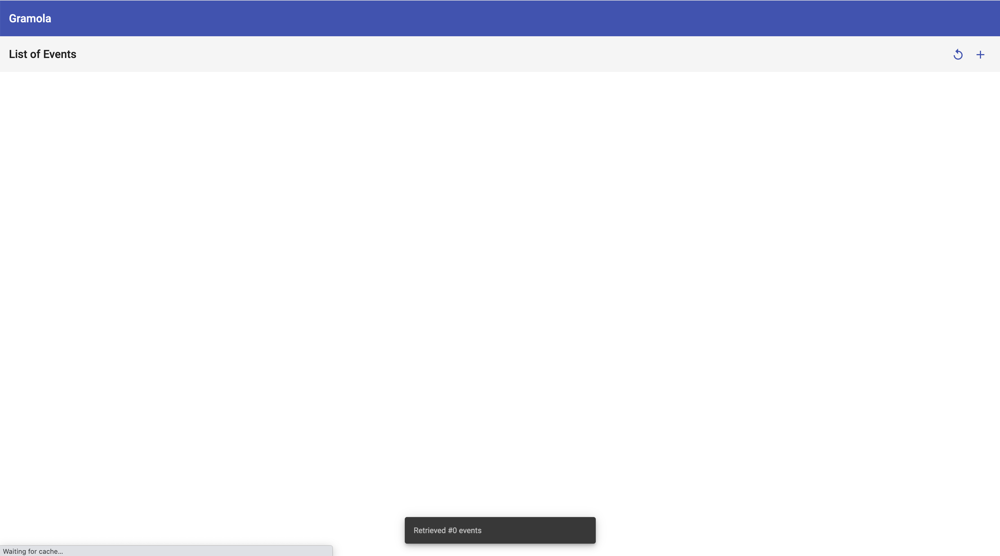

Let's create some sample data.

```sh
./create-sample-data.sh http://gateway-gramola-operator-system.minikube.local
```

Refresh the list of events by clicking on the `refresh`/`recycle` icon. Now you should see.


Great! You have tested version 0.0.1 of your operator running automatically through the [Operator Lifecycle Manager](https://github.com/operator-framework/operator-lifecycle-manager).

### Upgrading Gramola to v0.0.2

In order to use version 0.0.2 or our operator we have to update the CatalogSource we created to point to version 0.0.2 of the bundle index.

We can do that easily with this makefile target:

```sh
make catalog-deploy
```

After changing the CatalogSource the CatalogOperator updates the package manifests and the CSV is ready to be upgraded. Run this and check it out.

```sh
$ kubectl operator list
PACKAGE           SUBSCRIPTION      INSTALLED CSV            CURRENT CSV              STATUS          AGE
gramola-operator  gramola-operator  gramola-operator.v0.0.1  gramola-operator.v0.0.2  UpgradePending  5m
```

You can also explore the InstallPlans and see there's one that needs to be approved.

> **NOTE:** When we installed the operator by default it's set to `Manual` approval, but using `-a, --approval` you could have set it to `Automatic`

```sh
$ kubectl get installplan -n $PROJECT_NAME 
NAME            CSV                       APPROVAL   APPROVED
install-m6z8v   gramola-operator.v0.0.1   Manual     true
install-t2kk7   gramola-operator.v0.0.2   Manual     false
```

So we have to approve to upgrade... ok, let's do it.

```sh
$ kubectl operator upgrade $OPERATOR_NAME -n $PROJECT_NAME 
operator "gramola-operator" upgraded; installed csv is "gramola-operator.v0.0.2"
```

If you're fast enough you'll see the current operator pod being terminated...

```sh
$ kubectl get pod -n $PROJECT_NAME | grep gramola-operator-controller-manager
NAME                                                   READY   STATUS        RESTARTS   AGE
gramola-operator-controller-manager-696b664764-64wz4   2/2     Running       0          17s
gramola-operator-controller-manager-fb7f56868-mcnvj    0/2     Terminating   0          6h21m
```

Let's describe the AppService object. As explained before this operator on it's version 0.0.2 changes the database schema... and that has implications... the backend and gateway code expects some columns and so does the frontend. This means the schema changes and existing data has to be migrated. Pay attention below to the Status section and you'll see that the operator tries several times to update PostgreSQL until it succeeds.

```
$ kubectl describe appservice -n $PROJECT_NAME 
Name:         appservice-sample
Namespace:    gramola-operator-system
Labels:       <none>
Annotations:  <none>
API Version:  gramola.atarazana.com/v1
Kind:         AppService
Metadata:
  Creation Timestamp:  2020-09-01T09:22:33Z
  Generation:          2
    Manager:         manager
    Operation:       Update
    Time:            2020-09-01T15:27:31Z
  Resource Version:  11913
  Self Link:         /apis/gramola.atarazana.com/v1/namespaces/gramola-operator-system/appservices/appservice-sample
  UID:               6a7af5af-e2f3-4794-9899-4e070155b9be
Spec:
  Domain Name:  minikube.local
  Enabled:      true
  Initialized:  true
  Location:     EMEA
  Platform:     kubernetes
Status:
  Events Database Script Runs:
    Events Database Updated:  Failed
    Script:                   events-database-update-0.0.2.sql
    Events Database Updated:  Failed
    Script:                   events-database-update-0.0.2.sql
    Events Database Updated:  Succeeded
    Script:                   events-database-update-0.0.2.sql
  Events Database Updated:    Succeeded
  Last Action:                NoAction
  Last Update:                2020-09-01T15:27:31Z
  Status:                     True
Events:
  Type     Reason                      Age                  From              Message
  ----     ------                      ----                 ----              -------
  Warning  ProcessingError             2m5s                 gramola-operator  Failed executing command psql -U $POSTGRESQL_USER $POSTGRESQL_DATABASE -f /operator/scripts/events-database-update-0.0.2.sql on gramola-operator-system/events-database-85df7b86f4-jm2fm: command terminated with exit code 1
  Normal   Secret Created/Updated      119s (x2 over 2m9s)  gramola-operator  Created/Updated events-database Secret
  Normal   Deployment Created/Updated  116s (x2 over 2m9s)  gramola-operator  Created/Updated events-database Deployment
  Normal   Service Created/Updated     116s (x2 over 2m9s)  gramola-operator  Created/Updated events-database Service
  Normal   ConfigMap Created/Updated   116s (x2 over 2m9s)  gramola-operator  Created/Updated events-database-scripts ConfigMap
  Normal   Deployment Created/Updated  115s (x2 over 2m9s)  gramola-operator  Created/Updated events Deployment
  Normal   Service Created/Updated     115s (x2 over 2m9s)  gramola-operator  Created/Updated events Service
  Normal   Service Created/Updated     114s (x2 over 2m8s)  gramola-operator  Created/Updated gateway Service
  Normal   Deployment Created/Updated  114s (x2 over 2m9s)  gramola-operator  Created/Updated gateway Deployment
  Normal   Ingress Created/Updated     113s (x2 over 2m7s)  gramola-operator  Created/Updated gateway Ingress
  Normal   Deployment Created/Updated  113s (x2 over 2m7s)  gramola-operator  Created/Updated frontend Deployment
  Normal   Service Created/Updated     113s (x2 over 2m7s)  gramola-operator  Created/Updated frontend Service
  Normal   Ingress Created/Updated     113s (x2 over 2m6s)  gramola-operator  Created/Updated frontend Ingress
```

### Testing version 0.0.2

As we did before, open a browser and point to [http://frontend-gramola-operator-system.minikube.local](http://frontend-gramola-operator-system.minikube.local). You should see something like this:

> **NOTICE:** The event date has been split into Start and End dates...


## Using [Operator Lifecycle Manager Console](https://github.com/operator-framework/operator-lifecycle-manager/#user-interface)

So in this case, instead of the using the `kubectl operator` plugin we're going to use a web console.

```sh
mkdir -p ~/operators/tools
cd ~/operators/tools
git clone https://github.com/operator-framework/operator-lifecycle-manager
cd operator-lifecycle-manager
```

Using it for demo purposes is very easy. Just run this in a new terminal.

> **WARNING:** If on macOS or just if the script doesn't find docker or podman open file `./`, find function `verify_podman_binary` and just set your container engine to `podman` or `docker`. In this case I set it to `docker`.
> 
> ```bash
> # Check if Podman binary exists
> verify_podman_binary() {
>     if hash podman 2>/dev/null; then
>         POD_MANAGER="podman"
>     else
>         POD_MANAGER="docker"
>     fi
>     POD_MANAGER="docker" <<<< LOOK HERE
> }
> 

```sh
make run-console-local
```

Now in another terminal open [http://localhost:9000/](http://localhost:9000/dashboards) it's going to use your `.kube/config` credentials to connect to your cluster. You should see this:

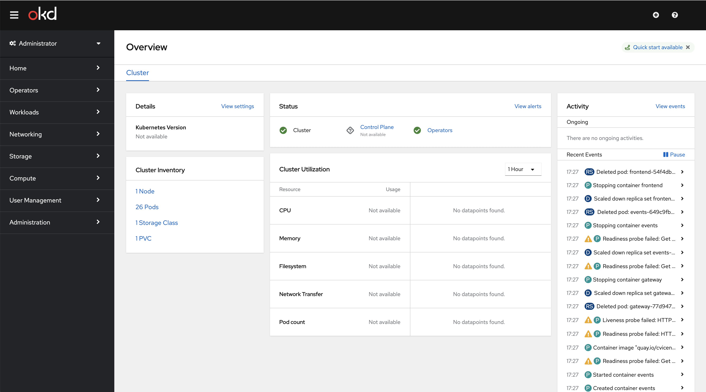

Now click on `Operators->Installed Operators`. If, you see nothing there, try setting the namespace to `gramola-operator-system`.

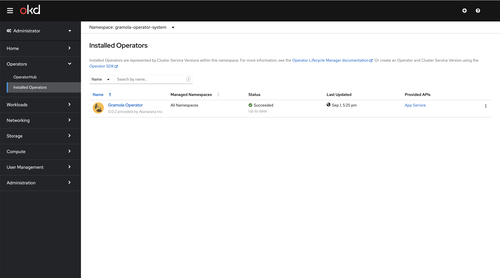

Let's uninstall the operator. Click on the `three dots` and select `Uninstall Operator`


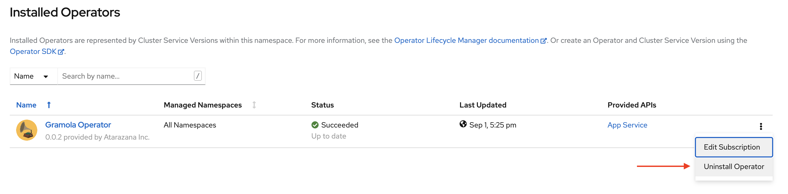

Now let's delete the AppService and the CatalogSource to start fresh.

```sh
$ kubectl delete appservice appservice-sample -n $PROJECT_NAME 
appservice.gramola.atarazana.com "appservice-sample" deleted
$ make catalog-undeploy
sed "s|BUNDLE_INDEX_IMG|quay.io/cvicens/gramola-operator-index:v0.0.2|" ./config/catalog/catalog-source.yaml | kubectl delete -n olm -f -
catalogsource.operators.coreos.com "atarazana-catalog" deleted
```

Let's create the CatalogSource for the previous (0.0.1) version:

```sh
$ make catalog-deploy-prev
sed "s|BUNDLE_INDEX_IMG|quay.io/cvicens/gramola-operator-index:v0.0.1|" ./config/catalog/catalog-source.yaml | kubectl apply -n olm -f -
catalogsource.operators.coreos.com/atarazana-catalog created
```

Go back to the web console and click on `Operators->OperatorHub`. You should see a new category `Other` as in the picture, if you don't see it, be patient and refresh, eventually it will show up.

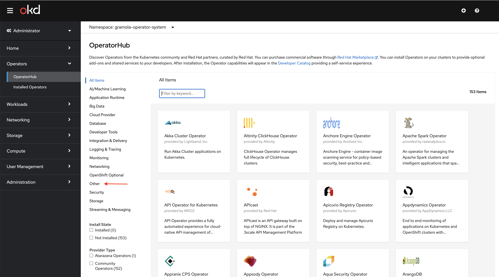

Click on the new category, then on the Gramola Operator. Once there, click on Install.

> **NOTICE:** Version is `0.0.1` and Capability level is `Basic Install`

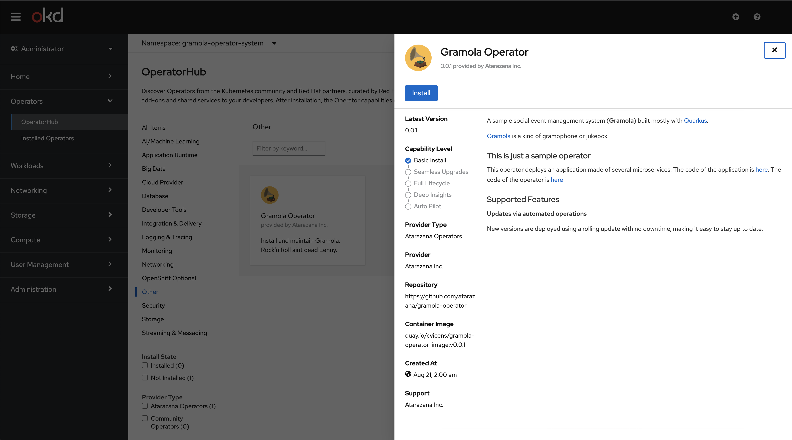

Make sure all this is selected, then click on `Install`:

* Installation Mode: `A specific namespace in the cluster`
* Installed Namespace: `gramola-operator-system`
* Approval Strategy: `Automatic`

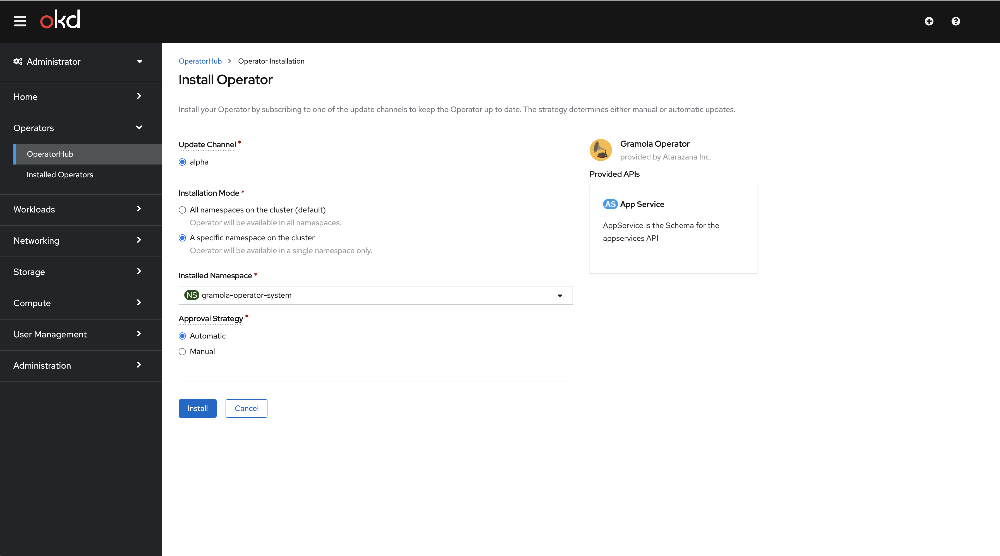

After a little while you should see this. Then click on `View Operator`.

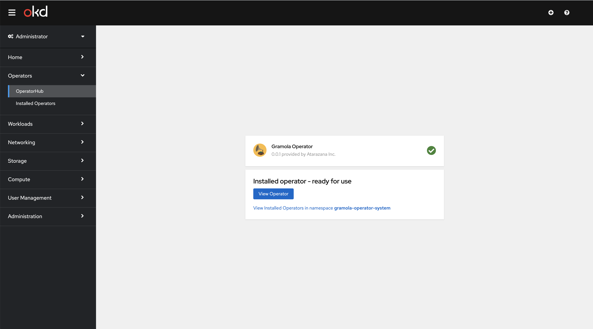

Create an instance of AppService:

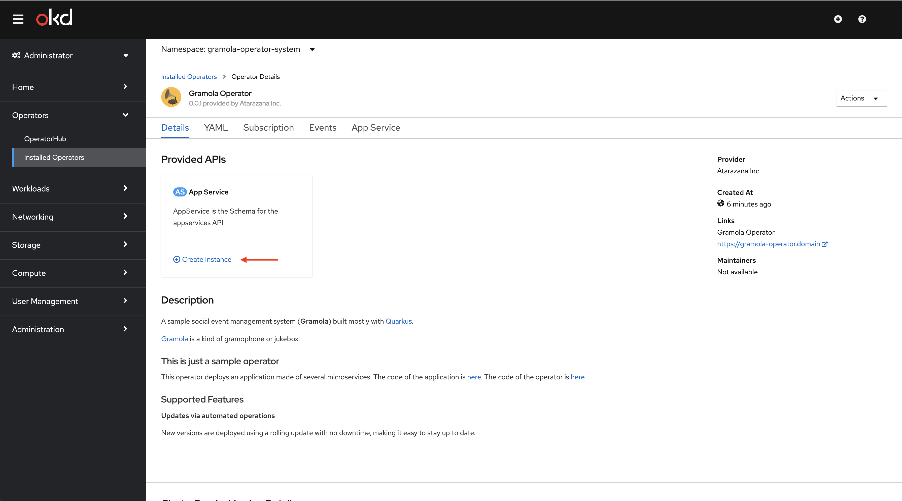

Filling the form and creating the object. Have a look to the different attributes, make sure that if you play with `Platform` you select `kubernetes` before clicking on 

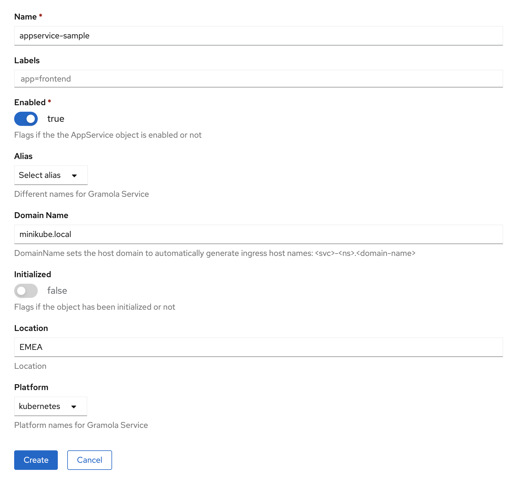

Let's have a look to the resources associated to the AppService you have created. Click on the AppService:

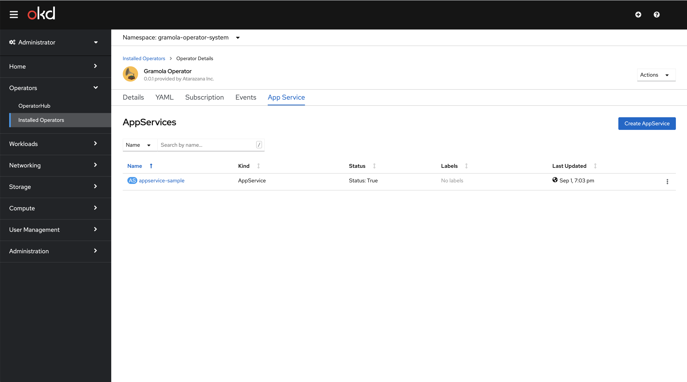

Explore the resources created:

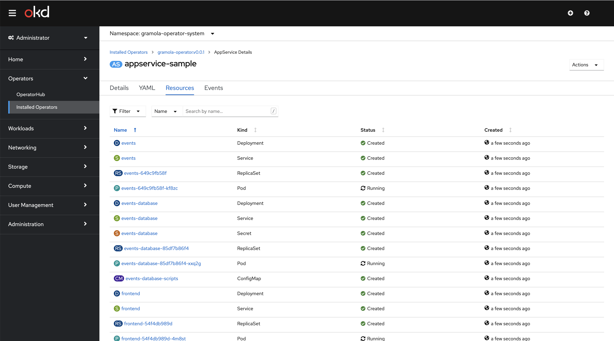

As we did with the `operator` plugin, let's create some sample data.

```sh
./create-sample-data.sh http://gateway-gramola-operator-system.minikube.local
```

Refresh the list of events by clicking on the `refresh`/`recycle` icon. Now you should see.


Great! You have tested version 0.0.1 of your operator running automatically through the [Operator Lifecycle Manager](https://github.com/operator-framework/operator-lifecycle-manager).

### Upgrading Gramola to v0.0.2

We do exactly as before, this updates the CatalogSource to index 0.0.2:

```sh
make catalog-deploy
```

This time is different, if you go to `Operators->Installed Operators->Gramola Operator`. Then click on `Subscription`. If you're fast enough you will see:

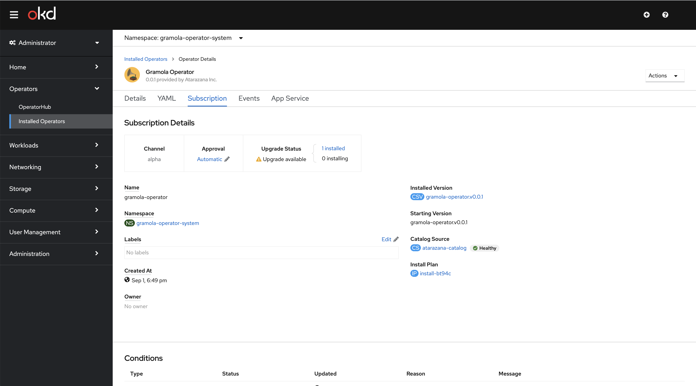

Let's have a look to the pods created. You can explore other areas too.

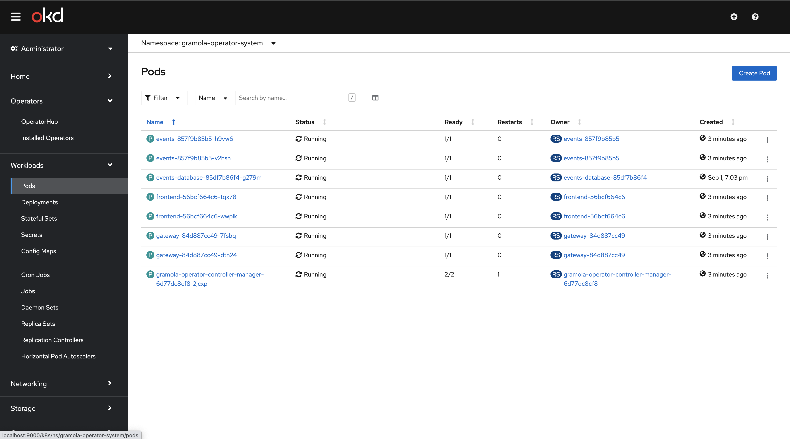

### Testing version 0.0.2

As we did before, open a browser and point to [http://frontend-gramola-operator-system.minikube.local](http://frontend-gramola-operator-system.minikube.local). You should see something like this:

> **NOTICE:** The event date has been split into Start and End dates...


