# Part Two (B): Deploy and Upgrade Gramola using [OLM](https://github.com/operator-framework/operator-lifecycle-manager) on OpenShift

Most of the text is the same as in the other Part Two. I did it to avoid you going back and forth...

Part Two is way easier and doesn't involve coding. If you skipped part one because you don't know if you want to spend the time it takes until you have a deeper understanding and how it all works you're at the right place.

Here we will install and upgrade the Gramola Operator, an operator in charge of installing and upgrading an application that involves data (*that changes its schema over time

In general you see demos of operators that install a given system and that's it. This is not the case, Gramola, although it is a super-simple musical events system as explained before, stores events in a PostgreSQL database, more over, a change in the database schema is introduced in version 0.0.2 so the operator not only cares about installing the components (Deployments, ConfigMaps, Secrets, etc.) it also cares about updating the images of the different Deployments and, drum roll, upgrading the database schema if needed and migrating data if the schema suffered any changes. All this makes this demonstration, at least so I think, more interesting than the usual demo.

We've divided this demo into:

1. Install the CatalogSource and deploy version 0.0.1
2. Generate some data
3. Upgrade the operator moving from version 0.0.1 to 0.0.2

End result:


# Prerequisites

It would be nice to have basic understanding of what an operator is to follow this guide, but it's not a requirement. Additionally if you want to run the demo you also need:

* Kubernetes/OpenShift Cluster (where you have administrative permissions) or use [Minikube](https://minikube.sigs.k8s.io/docs/start/) as we're going to do most of the time in this guide.

**NOTE:** If you had had a look to the [other flavor](./part-2-1.md) of this guide you may have noticed there're less requirementes here: no need to clone the repo, no need to install OLM, no need to install NGINX Ingress Controller... Why? OpenShift has it all installed and ready to use OOTB.

# Deploy a CatalogSource pointing to Gramola Bundle Index 0.0.1

Log in the OpenShift console as a user with administrative privileges and go to `Home->Projects`. We need a project (namespace) to work on so click on `Create Project` and name your project `gramola-operator-system`.

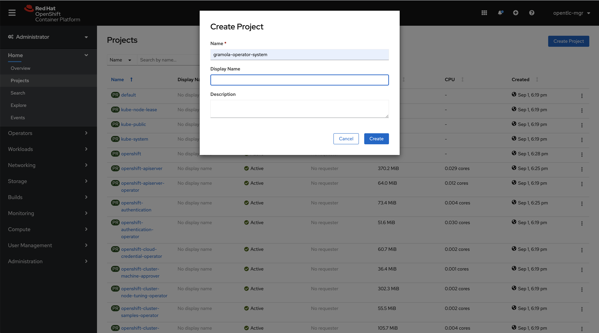

Now let's add a yaml describing a CatalogSource, click on the `+` sign at the top as in the picture.

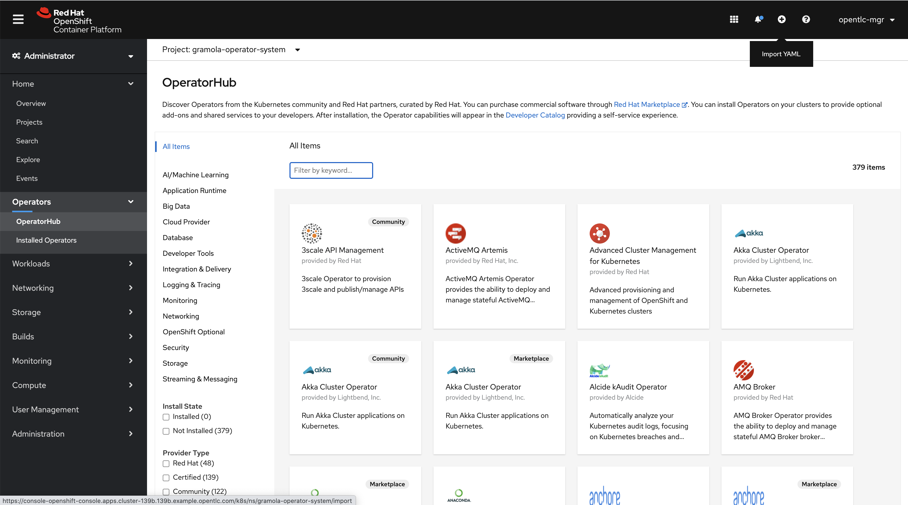

Copy and paste the next content and click `Create`.

```yaml
apiVersion: operators.coreos.com/v1alpha1
kind: CatalogSource
metadata:
  name: atarazana-catalog
spec:
  displayName: Atarazana Operators
  publisher: Atarazana Inc.
  sourceType: grpc
  image: quay.io/cvicens/gramola-operator-index:v0.0.1
```


# Installing version 0.0.1 of Gramola Operator

Now go to `Operators->OperatorHub`. Refresh until you see a new category: `Other`. Then click on it, you should see this.

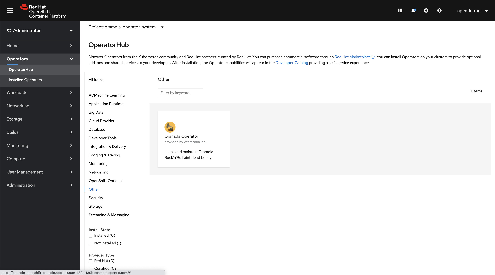

Click on the Gramola Operator. Once there, click on Install.

> **NOTICE:** Version is `0.0.1` and Capability level is `Basic Install`

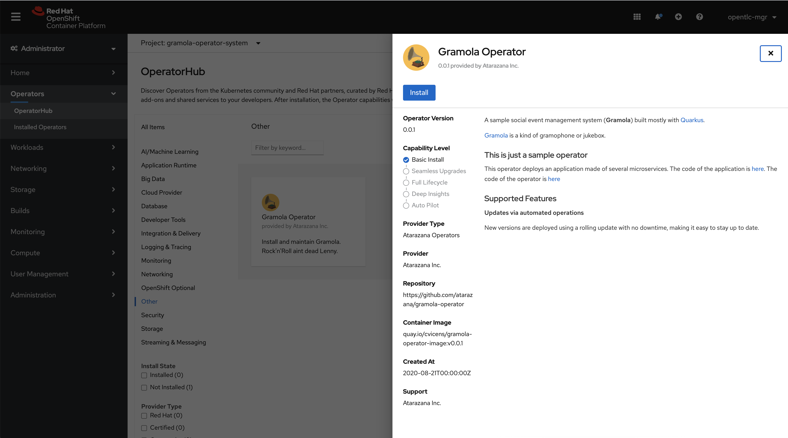

Make sure all this is selected, then click on `Install`:

* Installation Mode: `A specific namespace in the cluster`
* Installed Namespace: `gramola-operator-system`
* Approval Strategy: `Automatic`

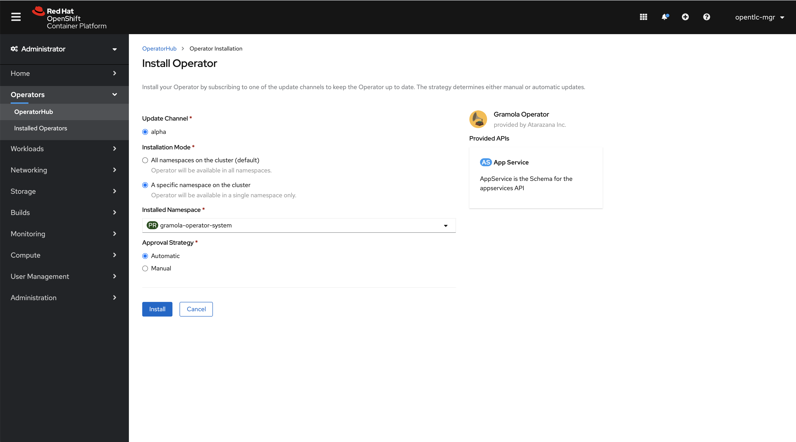

After a little while you should see this. Then click on `Gramola Operator`.

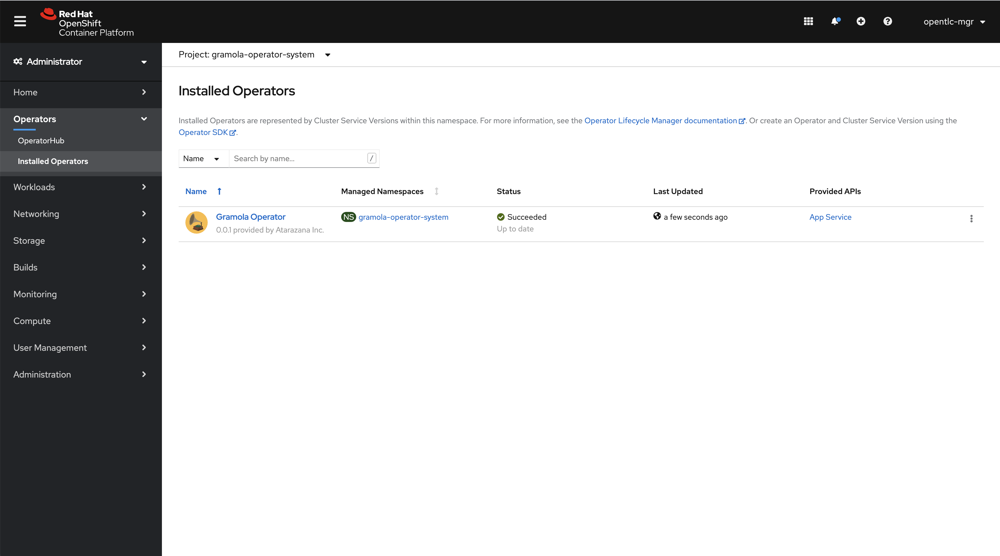

# Deploying Gramola 0.0.1 using the Gramola Operator

In order to deploy Gramola we need to create an instance of AppService. The main and in this case only CRD handled by the operator:

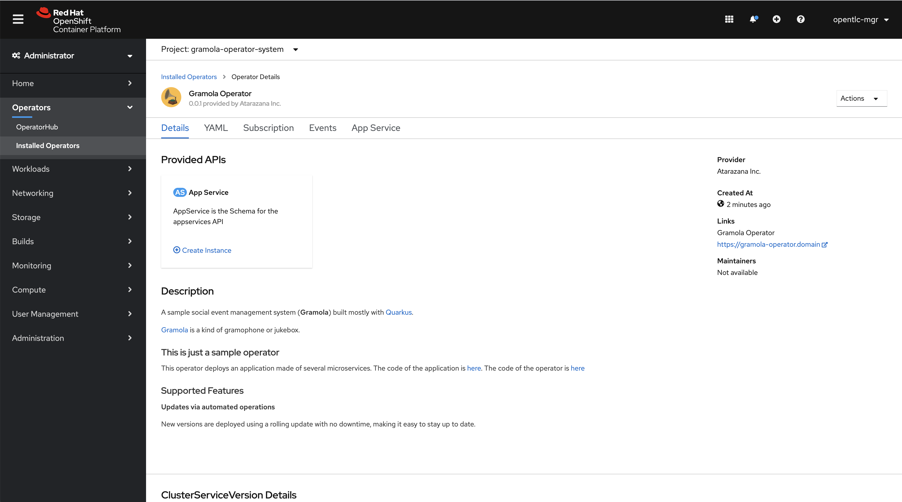

Filling the form and creating the object. Have a look to the different attributes, make sure that if you play with `Platform` you select `openshift` before clicking on 

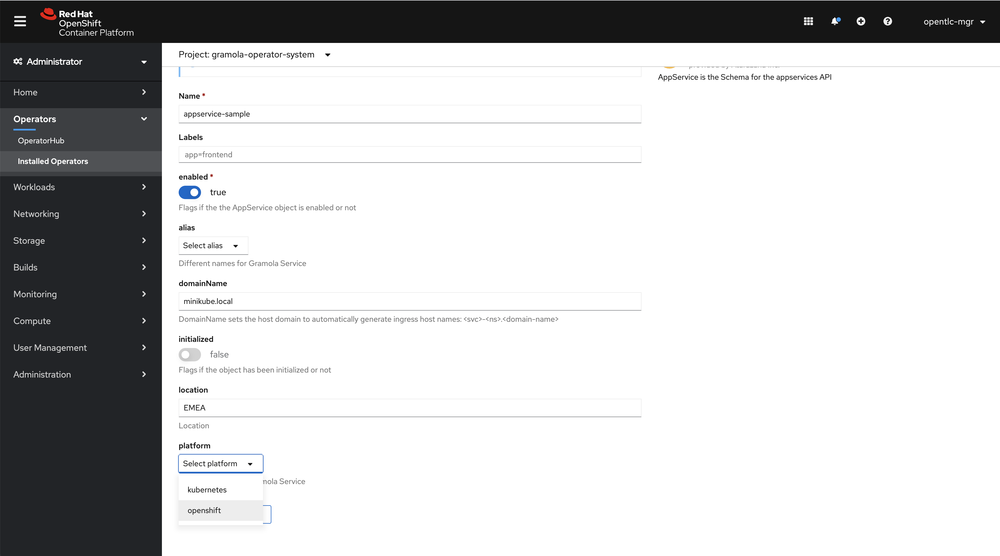

If you want to have a look to the AppService you have created. Click on the AppService:

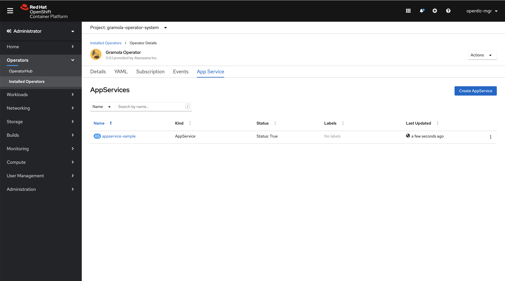

Now let's have a look to the Topology in the Developer view. Click on `Administrator` (upper left corner) and select `Developer`:

> **NOTE:** You'll see the graph evolve and deployments change status.

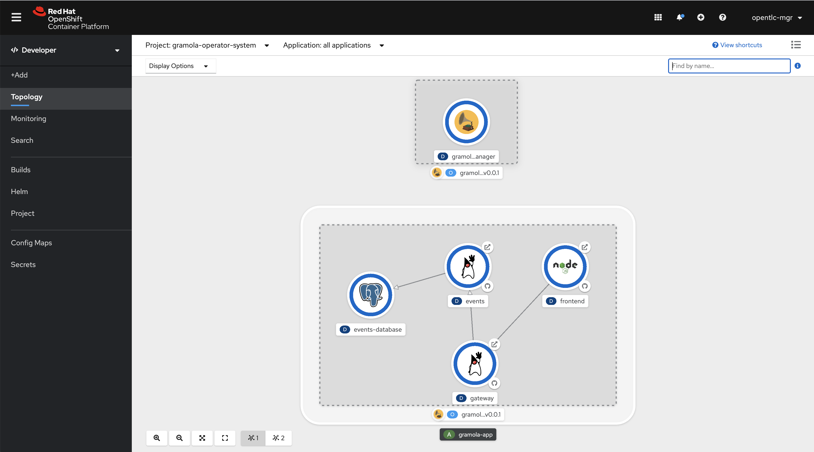

# Testing Gramola 0.0.1

Once all elements are dark blue (as in the picture above), click on the `gateway` deployment. Then copy the Route link, we'll use it in a second.


As we did with the `operator` plugin, let's create some sample data. Use the url you just copied without the ending slash `/`!!!!

> **NOTE:** Don't forget to delete the ending `/`. Don't say I didn't tell you.

```sh
./create-sample-data.sh <gateway-url>
```

In a similar fashion as we did for `gateway` copy the URL of `frontend`.

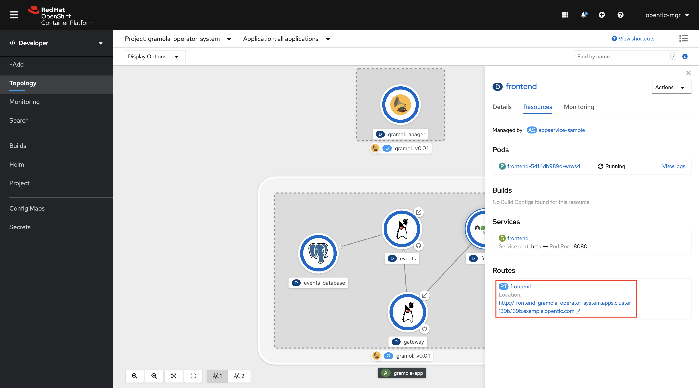

Open a browser pointing to the URL you just copied. Now you should see this:

> **NOTE:** Pay attention to the date field, this will change with 0.0.2

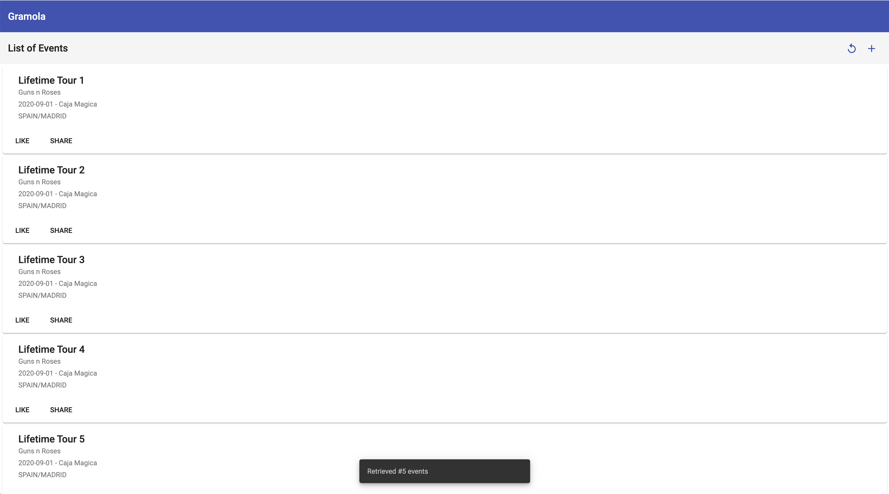

Great! You have tested version 0.0.1 of your operator running automatically through the [Operator Lifecycle Manager](https://github.com/operator-framework/operator-lifecycle-manager).

# Upgrading Gramola to 0.0.2

Let's edit the CatalogSource we created before. Go to `Search` and look for `CatalogSource` as in the picture.

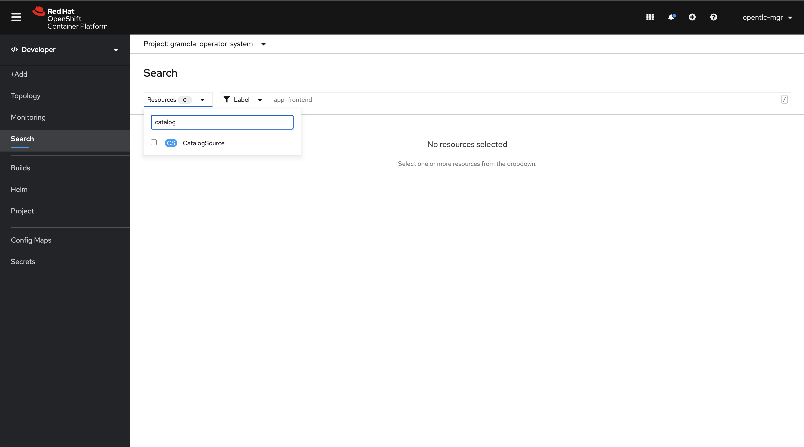

Then click on `atarazana-catalog`:

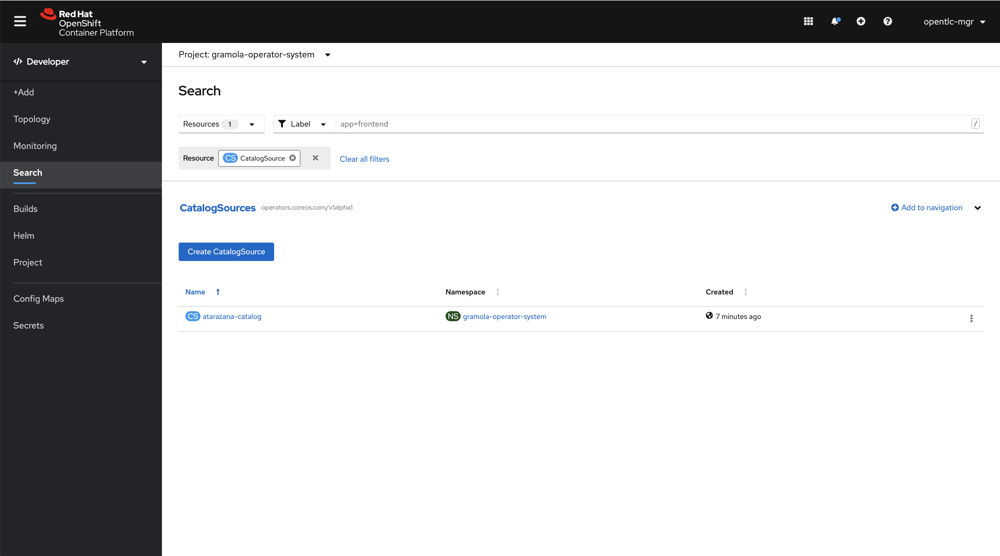

And in order to edit the descriptor click on `YAML`.

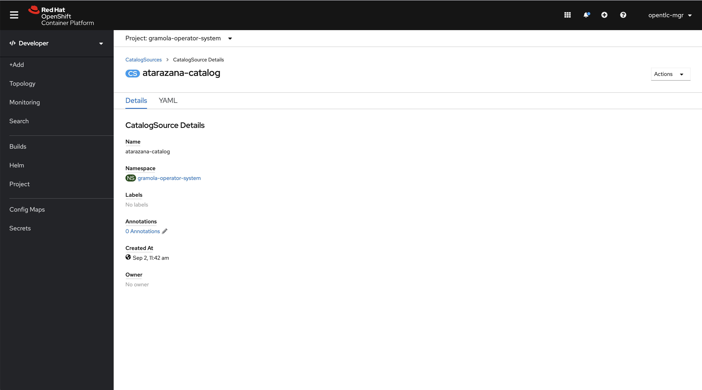

**Change 0.0.1 by 0.0.2** as in the picture then click on `Save`. 

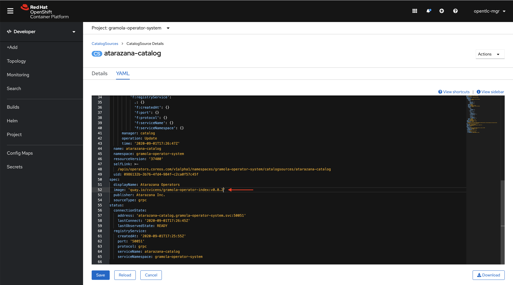

Please go to `Operators->Installed Operators->Gramola Operator`. Then click on `Subscription`. If you're fast enough you will see the operator upgrading, otherwise you'll find that 0.0.2 has been already installed.

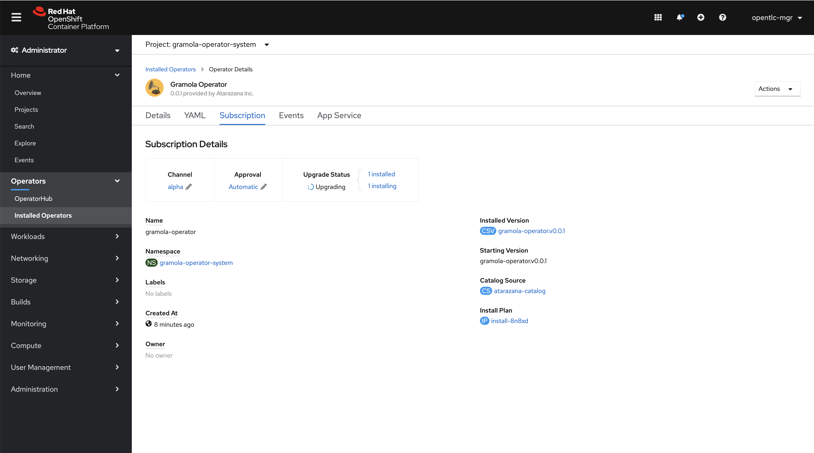

Let's go to `Topology` and see the system being updated.

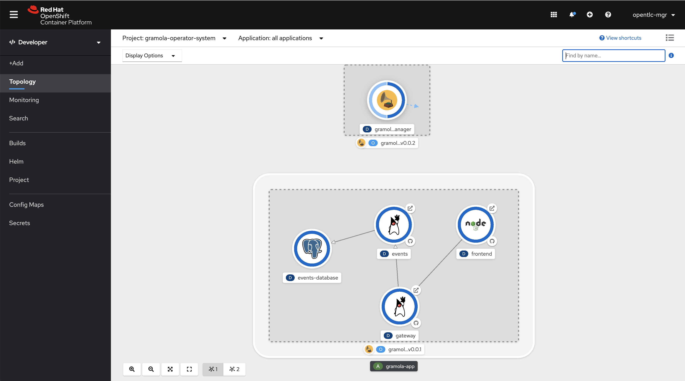

Transitioning... database upgrade, images update, etc.


# Testing version 0.0.2

Once the deployments have been stabilized (all dark blue) open a new browser/new tab and point to the `fronted` URL we used before. This time you should see something like this:

> **NOTICE:** The event date has been split into Start and End dates...

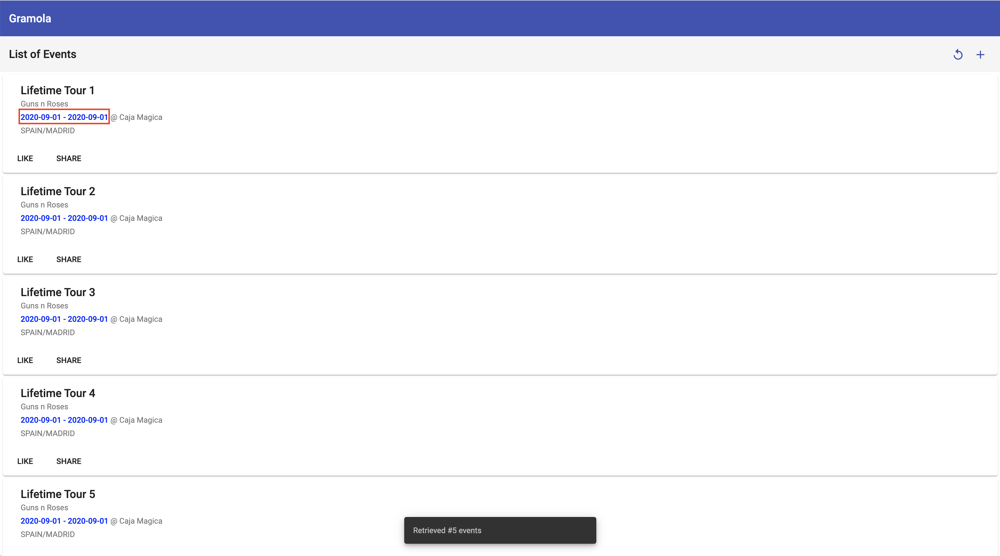

So you have deployed 0.0.1, created data and then moved to 0.0.2 and all components and database schema have been upgraded and data migrated all automatically. Awesome!

# Final thoughts

How is this demo different [to the ones on vanilla kubernetes](./part-2-1.md)?

In several aspects:

* No need to install OLM because is part of OpenShift and as such is already installed and supported
* No need to install NGINX Ingress Controller, OpenShift uses Routes by default.
* Web Console integrates everything related to Operators although you can still use kubectl to deal with them.


